# ARCHITECTURE — AI-Powered Digital Twin of India's Climate

**ISRO Bharatiya Antariksh Hackathon (BAH) 2026 · Problem Statement 5**
**A high-fidelity, uncertainty-aware, edge-served digital twin of India's climate (rainfall + temperature), built on India's national datasets and an indigenous open stack.**

| | |
|---|---|
| **Codename** | *Bharat Climate Twin* (BCT) |
| **Document type** | Engineering blueprint (build spec, not survey) |
| **Status** | Converged — ready to implement |
| **Date** | 2026-06-21 |
| **PoC variables** | Daily rainfall + max/min temperature |
| **Primary pilot** | Marathwada / central Maharashtra drought belt `bbox [74.0, 17.5, 79.0, 21.0]` (W,S,E,N) |
| **Secondary pilot** | Kerala / Western Ghats `bbox [74.5, 8.0, 77.5, 13.0]` |
| **Source research** | `idea.md` + `research/01..06` (EO datasets, O(1) platform, AI/ML methods, DA + digital twin, visualization, data-access/infra) |

> **Reading guide.** This document is the single blueprint the build team executes against. It is opinionated and decisive: where the six research documents surfaced options, we pick one, justify it from the research, and add the depth needed to build. Every asset ID, library, bucket, and figure cited below is drawn from the research corpus. All sixteen required sections are present; all diagrams are Mermaid and have been syntax-validated.

---

## Table of Contents

1. [Executive Summary & Mapping to the 8 Evaluation Criteria](#1-executive-summary--mapping-to-the-8-evaluation-criteria)
2. [Design Principles](#2-design-principles)
3. [Pilot Region Definition](#3-pilot-region-definition)
4. [Data Layer](#4-data-layer)
5. [The 7-Layer Digital-Twin Reference Architecture](#5-the-7-layer-digital-twin-reference-architecture)
6. [Data Assimilation & Modeling Core](#6-data-assimilation--modeling-core)
7. [Fast-Platform / O(1) Serving Architecture](#7-fast-platform--o1-serving-architecture)
8. [What-If Scenario Engine](#8-what-if-scenario-engine)
9. [Visualization / Dashboard](#9-visualization--dashboard)
10. [API Design](#10-api-design)
11. [Deployment & Infrastructure](#11-deployment--infrastructure)
12. [Product Repository Structure](#12-product-repository-structure)
13. [Tech Stack Summary](#13-tech-stack-summary)
14. [Build Roadmap](#14-build-roadmap)
15. [Evaluation & Validation](#15-evaluation--validation)
16. [Risks & Mitigations](#16-risks--mitigations)

---

## 1. Executive Summary & Mapping to the 8 Evaluation Criteria

### 1.1 What we are building

The *Bharat Climate Twin* is a **dynamic virtual replica of India's climate system** that continuously evolves from real-time and historical observations, focused for the PoC on **rainfall and temperature** over a drought-prone pilot region (Marathwada). It is a *twin*, not a dashboard, because three things hold simultaneously:

1. **It tracks reality** through **data assimilation** — a two-stage Bayesian fusion that merges 30+ cross-validating sources (Indian satellites, global satellites, reanalyses) onto the **IMD gridded ground-truth anchor**, producing a best-estimate state **with a per-pixel uncertainty field**.
2. **It evolves and predicts** through an **AI/ML ensemble** (XGBoost/LightGBM + ConvLSTM + U-Net downscaler + SARIMAX/Analog, fused by stacking + EMOS + conformal prediction, with optional pretrained foundation-model forcing) that produces calibrated short-term forecasts and runs **DA-in-the-loop**.
3. **It is perturbable** through a **what-if engine** — a precomputed scenario-delta library + ML response surface that applies `+2 °C`, `−20 % monsoon rainfall`, or a `monsoon-onset shift` as a **client-side GPU shader delta** in sub-second time, with an async high-fidelity emulator path for bespoke scenarios.

The whole system is engineered for **O(1) edge serving**: all heavy O(n) work happens offline in a precompute pipeline that bakes a dual-chunked **Zarr** cube, **COG** rasters, **PMTiles** pyramids, **H3**-indexed aggregates, and a scenario-delta library, all served constant-time from **Cloudflare R2 + KV + Workers** to a **Next.js + MapLibre + deck.gl** client that renders on the user's GPU. The entire India grid is tiny (0.25° ≈ 135×129 ≈ 17k cells; 1.0° ≈ 31×31 ≈ 1k cells), which makes "precompute everything, serve a single sub-10 ms fetch" the dominant strategy rather than a luxury.

### 1.2 The headline numbers (why this is feasible and fast)

| Fact | Value | Consequence |
|---|---|---|
| India rainfall grid @ 0.25° | 135 × 129 = **17,415 cells** | One daily field ≈ tens of KB; decades fit in RAM |
| India temperature grid @ 1.0° | 31 × 31 = **961 cells** | Trivially cacheable per timestep |
| Distinct data sources cataloged | **40+** (≥30 used) | Mandate "never single-source" satisfied with margin |
| AI/ML methods cataloged | **45**; Tier-1 PoC = **5** | Cross-verifying ensemble, fast to train |
| Edge KV hot read | **0.5–10 ms** (p99 < 5 ms) | Point/scenario lookups feel instant |
| R2 egress | **zero** | Serving millions of tiles is free |
| PMTiles request per tile | **1–2 range GETs** | Serverless map tiles, no tile server |

### 1.3 Mapping to the 8 hackathon evaluation criteria

The architecture is deliberately structured so that **each scored criterion has a dedicated, demonstrable answer**.

| # | Evaluation criterion | How this architecture scores it | Where (sections) |
|---|---|---|---|
| 1 | **Problem Understanding & Clarity** | We restate PS5's verbs as terms of art — "fuses heterogeneous datasets" = data assimilation, "continuously evolves" = cycled assimilation, "integrates several models for uncertainty" = multi-model ensemble + UQ, "what-if" = scenario engine, "virtual replica" = digital twin. Pilot chosen for a clear drought policy story. | §1, §2, §3, §5 |
| 2 | **Data Usage & Pre-processing** | 30+ source consolidated table, IMD `_Bin` anchor via `imdlib`, harmonization to a common grid/CRS/calendar, quantile-mapping bias correction, **triple-collocation** cross-validation, gap-filling, **explicit "satellites fill each other's gaps."** | §4 |
| 3 | **Model Development & Technical Approach** | A 5-model Tier-1 ensemble across 4 independent method families + combiner, two-stage Bayesian DA, time-rolling spatially-blocked CV, trained/benchmarked on **IMDAA / BharatBench / IndiaWeatherBench**. | §6 |
| 4 | **Prediction Performance & Validation** | Full metric suite (RMSE/MAE/bias/ACC; CSI/POD/FAR/ETS/FSS; CRPS/Brier/reliability; SSIM; EDI), validated against held-out IMD obs with persistence + climatology + NWP baselines. | §6, §15 |
| 5 | **Digital Twin Concept Implementation** | The 7-layer reference architecture (Observation → Ingestion → Modeling+DA → State → Services → Apps → Feedback), DA-in-the-loop heartbeat, per-cell uncertainty, GSV/Polytope-style services — directly modeled on DestinE and NASA ESDT. | §5, §6, §11 |
| 6 | **Visualization & User Interface** | Next.js + MapLibre + deck.gl GPU dashboard, map+timeline+charts+what-if, GPU colormaps, before/after swipe, uPlot/ECharts, UX patterns borrowed from NASA Worldview / Windy / Climate Engine. | §9 |
| 7 | **Innovation & Creativity** | O(1) edge twin (H3 + PMTiles + KV), client-side GPU what-if deltas, conformal-calibrated uncertainty, DA-in-the-loop with an ML emulator, stated scale-up to latent/diffusion DA and LETKF. | §2, §6, §7, §8 |
| 8 | **Presentation & Communication** | Self-documenting blueprint with diagrams + tables; demo de-risked by PMTiles (runs without a live server); shareable URL state; export PNG/GIF. | §9, §11, §14 |

---

## 2. Design Principles

These seven principles are non-negotiable invariants. Every later decision is an instantiation of one or more of them.

### P1 — Multi-source fusion; never single-source
No variable is ever served from one sensor. Rainfall = IMD gauge ⊕ IMERG ⊕ GSMaP ⊕ INSAT-IMC ⊕ ERA5-Land/IMDAA fill; LST = INSAT-3D ⊕ MODIS ⊕ VIIRS ⊕ ERA5-Land skin-T reconstruction. This is mandated by PS5 ("integrate several climate models to consider uncertainty") and is the only defensible approach during the **monsoon**, when optical/IR LST suffers heavy cloud loss and microwave + reanalysis must fill in. Independence of error sources is curated (IMD-gauges ⟂ IMERG-passiveMW+IR ⟂ INSAT-IR-geo ⟂ ERA5-model ⟂ Meteosat-IODC-geo) so cross-validation is statistically valid.

### P2 — O(1) edge serving; precompute the expensive, serve the cheap
The hot path contains **no search**. Every interactive query is reduced to a *deterministic address*: a point → an **H3** 64-bit cell ID → a KV/array lookup; a tile → a **PMTiles** Hilbert ID → a byte range; an array slice → exact **Zarr** chunk keys; a scenario → `hash(params)` → a precomputed delta. All O(n) work (model runs, aggregations, scenario libraries, pyramids) happens **offline**; the dashboard only *reads*. Because the India grid is tiny, this is fully feasible.

### P3 — 30+ cross-validating methods (data **and** models)
Two ensembles, same philosophy. On the **data** side, ≥30 datasets cross-validate via triple collocation. On the **model** side, a diverse ensemble (trees, conv-recurrent nets, encoder-decoder CNNs, classical stats, foundation models, physics-hybrids) lets methods fill each other's failure modes — trees extrapolate poorly but are robust on tabular signals; ConvLSTM blurs extremes but captures motion; diffusion sharpens extremes but can hallucinate; FMs bring global physics but are coarse. They are fused and adversarially scored.

### P4 — Uncertainty-aware by construction ("a twin without uncertainty is just a map")
Every product ships a **per-pixel uncertainty field**. Triple-collocation error variances set fusion weights *and* seed the uncertainty map; kriging/OI yields an analysis-error variance for free; the ML ensemble is calibrated with **EMOS + conformal prediction** for guaranteed coverage. Uncertainty is a first-class visualization layer, not an afterthought.

### P5 — Scalable national framework from day one
The PoC is a vertical slice of a national system. The same Kalman-gain backbone scales OI → EnKF → LETKF; the same Zarr/COG/PMTiles/H3 substrate scales from one pilot box to all-India; the same edge serving scales from a demo to millions of requests. Nothing in the PoC is a dead-end prototype.

### P6 — Indigenous / Atmanirbhar / open stack
Honor and foreground India's national datasets (IMD, MOSDAC/INSAT, Bhuvan, NICES, IMDAA, India-WRIS). Use **open-source** libraries throughout — **MapLibre GL JS (BSD-3)** not proprietary Mapbox; PyTorch/TensorFlow; xarray/Zarr/COG/PMTiles; H3 (Apache-2.0). This aligns with the "Atmanirbhar Bharat" framing in PS5 and avoids vendor lock-in / billable map loads.

### P7 — Demo reliability and reproducibility
The stage demo must not depend on a live server or flaky Wi-Fi. Pre-bake demo timesteps to **PMTiles** so the map renders from static byte-ranges; cache raw `.grd` in R2 so we never re-scrape IMD; version every published artifact; use **VirtualiZarr/Icechunk**-style snapshots for reproducible scenario versions.

---

## 3. Pilot Region Definition

### 3.1 Primary pilot — Marathwada / central Maharashtra drought belt ⭐

```
bbox (W, S, E, N) = [74.0, 17.5, 79.0, 21.0]
tighter Marathwada core = [75.0, 17.7, 78.5, 20.5]
```

**Rationale (from research doc 06 §6 and doc 01 §13):**
- **Quintessential Indian drought hotspot** (Aurangabad/Chhatrapati Sambhajinagar, Beed, Latur, Osmanabad) with strong **monsoon variability** and recurrent drought — the ideal showcase for SPI/SPEI, dry-spell, and rainfall-anomaly modeling and for a clear **policy / climate-resilience story** (water and agricultural security).
- **Good IMD gauge density** — IMD's 0.25° rainfall product performs best over **peninsular India**, so the gauge anchor (P1) is strong here.
- **Mixed orographic Western Ghats + rain-shadow interior** gradient is a stringent test of multi-source fusion (P1, P3).
- **India-WRIS** has rich reservoir/groundwater series here, giving an **independent hydrological water-balance cross-check**.

### 3.2 Secondary pilot — Kerala / Western Ghats heavy-rain belt

```
bbox (W, S, E, N) = [74.5, 8.0, 77.5, 13.0]
```

Among the wettest parts of India; orographic monsoon **extremes** (2018/2019 floods) stress the heavy-rain indices (>64.5 mm, >124.5 mm/day per IMD classes) and validate IMERG/CHIRPS against IMD gauges. Provides **contrast** to the drought pilot for the "scalable national framework" narrative.

### 3.3 Exact grids the pilot inherits

| Variable | Source grid | Cells over India | Cells over Marathwada bbox (approx) | Common analysis grid |
|---|---|---|---|---|
| Rainfall | IMD 0.25° (6.5–38.5 N, 66.5–100.0 E; 135×129) | 17,415 | ~20 lon × 14 lat ≈ **280** | **0.25° (target grid)** |
| Tmax/Tmin | IMD 1.0° (7.5–37.5 N, 67.5–97.5 E; 31×31) | 961 | ~5 × 4 ≈ **20** | downscaled to 0.25° |
| INSAT LST/SST/IMC | 4 km geostationary | full disk | dense | regridded to 0.25° |
| IMERG | 0.1° | global | ~50 × 35 ≈ 1,750 | regridded to 0.25° |
| ERA5-Land | 0.1° (9 km) | global land | ~50 × 35 | regridded to 0.25° |
| IMDAA | 0.12° (12 km) | monsoon region | dense | regridded to 0.25° |

**Decision:** the **common analysis grid is IMD 0.25°** (EPSG:4326). All sources are regridded to it; temperature (native 1.0°) is treated as a coarse field to be **downscaled** to 0.25° by the U-Net (a deliverable in its own right). H3 keys: **res 4** for 0.25° rainfall (avg cell 1,770 km² ≈ closest to a 0.25° cell), **res 3** for 1.0° temperature, **res 2** for national rollups.

---

## 4. Data Layer

### 4.1 Consolidated dataset table (the 30+ sources actually used)

Anchored on the mandated IMD gridded `_Bin` products and INSAT (MOSDAC), then fused with global satellites and reanalyses chosen for **independent error structures** so each can fill the others' gaps and cross-validate. `GEE` = Google Earth Engine asset; `CDS` = Copernicus `cdsapi`; `EA` = NASA `earthaccess`; `MPC` = Microsoft Planetary Computer STAC; `S3` = anonymous AWS Open Data; `MOSDAC` = ISRO SAC `mdapi.py`.

| # | Dataset | Role in twin | Resolution / cadence | Access (exact) | Cross-validation / gap-fill partner |
|---|---|---|---|---|---|
| 1 | **IMD Gridded Rainfall 0.25°** | **ANCHOR TRUTH (rain)** | 0.25°, daily, 1901– | `imdlib` `get_data('rain')`; `.grd` 135×129 | Bias reference for all rain sources |
| 2 | **IMD Gridded Tmax 1.0°** | **ANCHOR TRUTH (Tmax)** | 1.0°, daily, 1951– | `imdlib` `get_data('tmax')`; 31×31 | Bias reference; U-Net downscale target |
| 3 | **IMD Gridded Tmin 1.0°** | **ANCHOR TRUTH (Tmin)** | 1.0°, daily, 1951– | `imdlib` `get_data('tmin')` | Bias reference |
| 4 | **IMD AWS/ARG network** | Point validation / downscaling | sub-daily, NRT | `mausam.imd.gov.in` | Validate grids; sparse-obs fusion |
| 5 | **IMD merged satellite-gauge rain** | Benchmark product | 0.25°, daily | `imdpune.gov.in/.../Rainfall_25_NetCDF_Merged.html` | Benchmark our fusion |
| 6 | **INSAT-3D/3DR/3DS LST** `3RIMG_L2B_LST` | High-cadence skin-T | 4 km, 30-min | MOSDAC `mdapi.py` | Bias-correct vs MODIS/VIIRS; diurnal fill |
| 7 | **INSAT SST** `3RIMG_L2B_SST` | Diurnal SST | 4 km, 30-min | MOSDAC | vs MODIS / Sentinel-3 / OISST |
| 8 | **INSAT Rainfall (IMC/Hydro-Est.)** `3RIMG_L2B_IMC` | Geostationary QPE | ~4 km, 30-min | MOSDAC | Fills 30-min gaps between IMERG MW overpasses |
| 9 | **INSAT Imager L1C** | Cloud/WV/Tb backbone | 1 km VIS, 4 km IR | MOSDAC | Geostationary motion for nowcast |
| 10 | **GPM IMERG V07 (Early/Final)** | **Primary satellite rain** | 0.1°, 30-min | `GEE NASA/GPM_L3/IMERG_V07`; `EA GPM_3IMERGHHE`/`DF`; `S3` | IMD anchor; TC triplet member |
| 11 | **GSMaP (v7/v6)** | Independent MW+IR rain | 0.1°, hourly | `GEE JAXA/GPM_L3/GSMaP/v7/operational` | Independent of IMERG → fusion/TC |
| 12 | **CHIRPS v2/v3** | Station-blended rain | 0.05°, daily | `GEE UCSB-CHG/CHIRPS/DAILY`; v3 `DAILY_SAT`/`DAILY_RNL` | Transitional zones; caution (v3 uses IMERG) |
| 13 | **CMORPH** | MW-propagated IR rain | 8 km / 0.25° | `GEE NOAA/CDR/CMORPH/V1` | Independent morphing algorithm |
| 14 | **PERSIANN-CDR / PDIR-Now** | ANN IR rain, NRT | 0.04–0.25° | CHRS portal; `GEE NOAA/PERSIANN-CDR` | ML-friendly long CDR |
| 15 | **MSWEP v3** | SOTA merged benchmark | 0.1°, 3-hourly | `gloh2o.org/mswep` | Benchmark our merged rain product |
| 16 | **ERA5** | Gap-free backbone | 0.25°, hourly | `CDS reanalysis-era5-single-levels`; `GEE ECMWF/ERA5/*`; `S3 nsf-ncar-era5` | Physics fill; TC member |
| 17 | **ERA5-Land** | **Best gap-free 2 m T** | 9 km, hourly | `CDS reanalysis-era5-land`; `GEE ECMWF/ERA5_LAND/HOURLY` | Bias-correct LST; T gap-fill; TC member |
| 18 | **IMDAA (NCMRWF)** | **India-specific reanalysis** | 12 km, hourly, 1979–2020 | NCMRWF RDS `rds.ncmrwf.gov.in` | Training data; outperforms ERA5 in wet/NE India |
| 19 | **MERRA-2** | Aerosol-aware, independent | 0.5°, hourly | `EA M2T1NXSLV`; `GEE NASA/GSFC/MERRA/*` | Independent reanalysis member (spread) |
| 20 | **NCEP/NCAR R1** | Long independent baseline | ~1.9°, 6-hourly | NOAA PSL OPeNDAP | Third reanalysis for TC |
| 21 | **JRA-3Q (JMA)** | Asian-centric reanalysis | ~0.375°, 3-hourly | JMA/DIAS | Independent member |
| 22 | **MODIS MOD11A1/MYD11A1 LST** | Fine LST truth (4×/day) | 1 km, daily | `GEE MODIS/061/MOD11A1`,`MYD11A1`; `EA` | Bias-correct INSAT LST; TC member |
| 23 | **VIIRS VNP21A1D/N LST** | MODIS-continuity LST | 1 km, daily | `GEE NASA/VIIRS/002/VNP21A1D` | Constrains INSAT diurnal curve |
| 24 | **Landsat 8/9 ST (TIRS)** | Fine-scale LST downscale | 100 m, ~8-day | `GEE LANDSAT/LC0{8,9}/C02/T1_L2`; `MPC landsat-c2-l2` | Thermal-sharpening covariate |
| 25 | **ECOSTRESS** | Ultra-high-res diurnal LST | ~70 m, irregular | `EA`; `MPC` | City/field-scale LST detail |
| 26 | **Sentinel-3 SLSTR LST** | European independent LST | 1 km, 1–2 day | `MPC sentinel-3-slstr-lst-l2-netcdf` | Independent LST/SST |
| 27 | **NOAA OISST v2.1** | Gap-free SST baseline | 0.25°, daily | `GEE NOAA/CDR/OISST/V2_1` | Baseline for INSAT SST |
| 28 | **SMAP L3/L4** | Soil moisture (T-P feedback) | 9 km; L4 3-hourly | `GEE NASA/SMAP/SPL4SMGP/008`; `EA` | Land-atm coupling; under-cloud T fill |
| 29 | **ASCAT (H SAF)** | Active soil moisture | 12.5 km, daily | EUMETSAT H SAF | Independent (active) SM; SM TC member |
| 30 | **ESA CCI Soil Moisture v09** | Merged 40-yr SM ECV | 0.25°, daily | CEDA; CDS | Long merged SM truth (built on TC) |
| 31 | **Sentinel-1 GRD** | All-weather flood/SM | 10 m, 6–12 day | `GEE COPERNICUS/S1_GRD`; `MPC` | Inundation context |
| 32 | **GRACE/GRACE-FO mascon** | Water-storage anomaly | ~3°, monthly | `EA TELLUS_GRAC-GRFO_...`; `GEE NASA/GRACE/...` | Drought signal independent of rainfall |
| 33 | **Sentinel-2 L2A** | NDVI/land-cover covariate | 10–60 m, ~5-day | `GEE COPERNICUS/S2_SR_HARMONIZED`; `MPC` | Thermal sharpening; downscale covariate |
| 34 | **Meteosat MSG/MTG (IODC 45.5°E)** | Independent geo over India | 1–3 km, 15-min | EUMETSAT Data Store | **Independent geostationary cross-check** |
| 35 | **Himawari-8/9 AHI** | Independent geo (E edge) | 0.5–2 km, 10-min | `S3 noaa-himawari9` | Algorithm cross-check vs INSAT |
| 36 | **FengYun-4A/4B AGRI** | Independent Asian geo | 0.5–4 km, 15-min | CMA NSMC | Independent geo covering India |
| 37 | **Oceansat-3 OSCAT-3 / OCM-3** | Winds / ocean context | 25 km / 1 km | MOSDAC; Bhoonidhi | Moisture transport → monsoon |
| 38 | **Bhuvan (NRSC OGC)** | Admin/LULC overlays | varies | WMS/WMTS `bhuvan.nrsc.gov.in` | Region boundaries; basemap layers |
| 39 | **NICES (NRSC) ECVs** | Indian climate ECVs | 1–5 km | Bhuvan/MOSDAC | Validation of derived ECVs |
| 40 | **India-WRIS** | Hydrology ground truth | basin/station | `indiawris.gov.in` REST/WMS | Independent water-balance closure |

> **Source-count ledger:** 40 listed; comfortably ≥30. Indian-origin sources: IMD (×5), INSAT (×4), Oceansat, Bhuvan, NICES, India-WRIS, IMDAA = **15+**. This satisfies both the "national datasets" mandate and the "never single-source" mandate.

### 4.2 Ingestion & harmonization pipeline

All ingestion is **offline** (CI: GitHub Actions / Modal). We virtualize the cold archive with **VirtualiZarr/Kerchunk** (no re-encode) and materialize a real Zarr cube only for the hot, frequently-served subset.

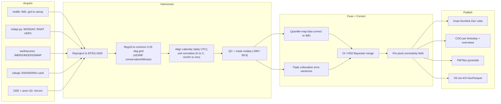

**Harmonization to a common grid / CRS / calendar (the prerequisite to fusion):**

| Concern | Decision | Tool |
|---|---|---|
| CRS | EPSG:4326 (WGS84) everywhere | `rioxarray.write_crs` |
| Grid | Regrid all to IMD **0.25°** target; conservative remap for fluxes (rain), bilinear for state (T) | `xESMF` / `xarray.interp` |
| Calendar | Daily, UTC; sub-daily aggregated to daily (rain = sum, Tmax = max, Tmin = min) | `xarray.resample` |
| Units | rain → **mm/day** (IMERG mm/hr × 0.5 per 30-min slot then sum; ERA5 m → mm); T → **°C** (K − 273.15; MODIS LST × 0.02 − 273.15) | numpy |
| No-data | mask IMD rain `-999.0`, temp `99.9` (verify per file); satellite `_FillValue` | numpy `where` |
| Binary parse | `imdlib` first; `numpy.fromfile('<f4')` fallback (135×129 rain, 31×31 temp, lon fastest, S→N) | `imdlib` / numpy |

The harmonized output is the **Generic State Vector (GSV)** — one format, units, and grid (the DestinE archetype) — which is what the modeling+DA core consumes.

### 4.3 Fusion + bias-correction + triple-collocation cross-validation

This is the heart of "use many satellites to fill each other's gaps." It is a **two-stage** procedure (detailed mathematically in §6.1).

**Stage 1 — per-source bias correction to the IMD anchor.** Each satellite/reanalysis field is quantile-mapped (CDF matching) to the IMD gauge grid at **monthly scale per grid cell**. This corrects the well-known biases (satellite IR overestimates light rain, underestimates orographic extremes; reanalysis precip drizzle bias).

**Stage 2 — precision-weighted Bayesian merge.** Bias-corrected sources are merged by **Optimal Interpolation / Kriging-with-External-Drift**, with weights ∝ 1/error-variance where error variances come from **triple collocation**.

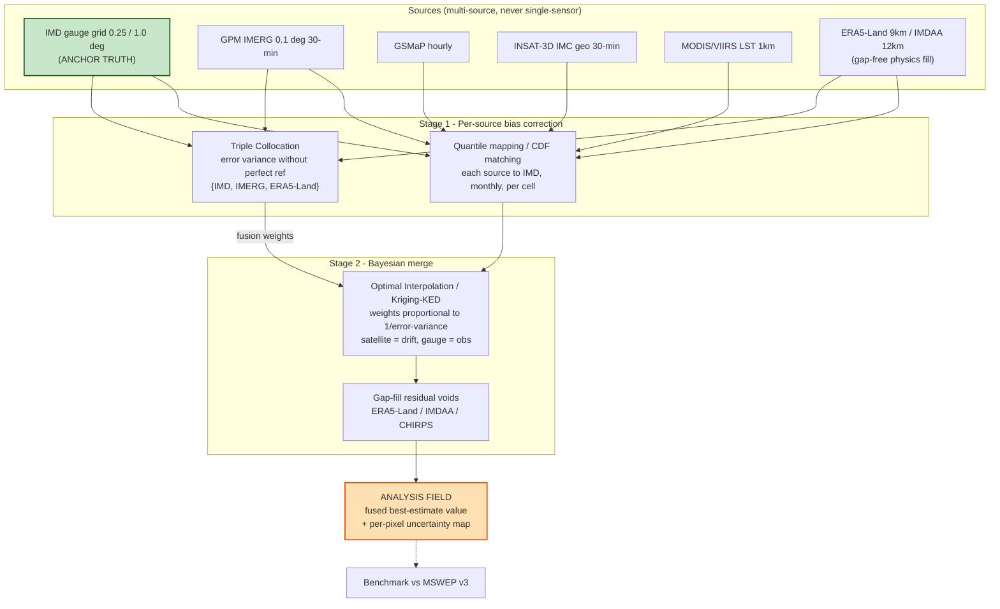

**Triple-collocation (TC) triplets — independent error structures (mandatory for validity):**

| Variable | TC triplet | Why independent |
|---|---|---|
| Rainfall | IMD-gauge ⟂ IMERG-satellite ⟂ ERA5-Land-reanalysis | gauge vs passive-MW+IR vs model |
| LST / temperature | IMD/in-situ ⟂ MODIS-LST ⟂ ERA5-Land-skinT | gauge vs IR-polar vs model |
| Soil moisture | SMAP-passive ⟂ ASCAT-active ⟂ ERA5-Land/GLDAS-model | the classic, well-validated SM triplet |

> **Independence caveats honored:** ERA5-Land is **not** independent of ERA5; CHIRPS v3 daily **uses** IMERG-Late — so these pairs are never used as independent TC members.

### 4.4 "Satellites fill each other's gaps" — made explicit

This is the concrete wiring (research doc 01 §11):

- **Temporal gaps:** **INSAT-3D/3DR/3DS IMC** (geostationary, 30-min) fills the *time* gaps between IMERG/GSMaP microwave overpasses; conversely IMERG/GSMaP fill INSAT's IR-only weakness on rain *intensity*. Combined INSAT trio gives an effective **~15-min** refresh.
- **Cloud gaps (monsoon LST):** where IR sensors (MODIS/VIIRS/INSAT) see cloud during JJAS, substitute **ERA5-Land skin temperature** and **SMAP L4 soil temperature**, and reconstruct under-cloud LST with a **diurnal-temperature-cycle (DTC) model** fit to clear INSAT pixels and regularized by ERA5-Land.
- **Resolution gaps:** sharpen INSAT/MODIS LST (4 km / 1 km) to **100 m (Landsat ST)**, **70 m (ECOSTRESS)**, or **10–30 m** using NDVI/albedo from Sentinel-2/Landsat (thermal sharpening: DisTrad/TsHARP), for city/field-scale views.
- **Spatial gauge gaps:** where the IMD gauge network thins, **Kriging-with-External-Drift** uses the satellite/reanalysis field as the *drift* so the merged field follows satellite spatial patterns but stays anchored to gauges.
- **Independent geo cross-check:** because India sits at the edge of Himawari, we add **Meteosat-IODC (45.5°E, views all of India)** and **FengYun-4** as independent geostationary cross-checks of INSAT.

### 4.5 Per-pixel uncertainty field

The twin's uncertainty layer is assembled from three contributions and stored **alongside** every value (in the Zarr cube and as a paired COG/PMTiles layer):

1. **TC error variance** per source → propagated through the precision-weighted merge.
2. **Kriging/OI analysis-error variance** `A = (I − KH)B` — free from the merge step.
3. **ML ensemble spread**, calibrated by **EMOS** and wrapped with **conformal prediction** for guaranteed coverage at decision thresholds (flood/heat).

---

## 5. The 7-Layer Digital-Twin Reference Architecture

Synthesized from **DestinE** (ECMWF), **NASA ESDT**, **NVIDIA Earth-2**, and generic DDDAS digital-twin patterns, the same 7 layers recur. The diagram below is the canonical reference architecture for the *Bharat Climate Twin*; Layer 7 (feedback) is rendered as the dashed/heavy return edges (the "heartbeat" that makes it a twin, not a dashboard).

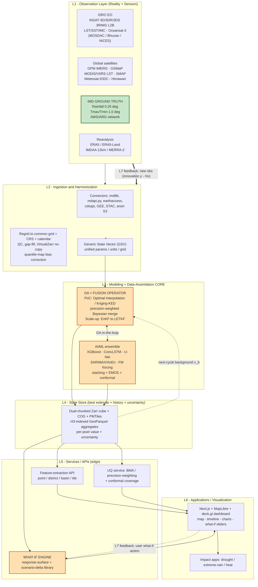

### 5.1 Layer-by-layer technology choices

| Layer | What it is | PoC technology | Scale-up | Why |
|---|---|---|---|---|
| **L1 Observation** | Real Earth + sensors (reanalysis = past "observation" proxy) | INSAT (MOSDAC) + IMERG + **IMD gridded ground truth** + ERA5/ERA5-Land | + Oceansat, IMDAA, AWS/ARG, Meteosat-IODC | Mandated national datasets; IMD = anchor truth |
| **L2 Ingestion/Harmonization** | Collect, decode, regrid, QC, standardize → GSV | Python `imdlib`/`mdapi.py`/`earthaccess`/`cdsapi`/`xESMF`; quantile-map bias-correct; **VirtualiZarr** no-copy | **Kafka + Flink** event-driven | Harmonization is the prerequisite to fusion |
| **L3 Modeling+DA core** | Physical/ML models + DA fusing obs into state | **OI / Kriging-KED** + precision-weighted Bayesian; **ConvLSTM/U-Net/XGBoost** ensemble; DA-in-the-loop | **EnKF → LETKF**; FourCastNet/AIFS-class emulator | BLUE-optimal, no adjoint, explainable; clean ensemble path |
| **L4 State store** | Current best estimate + history + uncertainty | **Dual-chunked Zarr** + COG + PMTiles + H3 GeoParquet on **R2**; value+uncertainty; streaming window | FDB-style + data lake; Icechunk versioning | Fast slice for map; history for what-if; tiny grid → cacheable |
| **L5 Services/APIs** | Query, feature-extract, subscribe | **Cloudflare Workers** edge API (Polytope/earthkit-style point/region extraction); **what-if** engine; **UQ** service | server-side hypercube extraction | "Bring users to the data"; sub-second |
| **L6 Apps/Visualization** | Dashboards, impact models, map UI | **Next.js + MapLibre + deck.gl**; sliders; uncertainty layer; impact alerts | impact-sector models coupled | Required deliverables; GPU client rendering |
| **L7 Feedback loop** | New obs → re-assimilate → update; user what-if → re-simulate | **Daily cycle**: state → background → re-assimilate; user action → re-simulate | hourly cycled DA | The loop that makes it a *twin* |

### 5.2 The continuous-update heartbeat

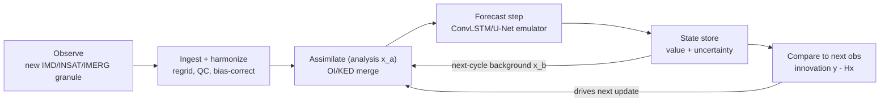

The **innovation** `(y − Hx^b)` at each cycle measures how far the replica has drifted from reality and corrects it. **Latency tiers:** a *hot path* (event → quick OI nudge → dashboard, seconds–minutes) and a *warm path* (scheduled full re-analysis + forecast, per cycle) give "near-real-time climate states" without a supercomputer.

---

## 6. Data Assimilation & Modeling Core

### 6.1 Two-stage Bayesian fusion (the DA engine)

All DA methods solve the same Bayesian estimation problem: given a background `x^b` (prior, error covariance `B`) and observations `y` (error covariance `R`, observation operator `H`), the BLUE/Kalman update is

```
x^a = x^b + K (y − H x^b),     K = B Hᵀ (H B Hᵀ + R)⁻¹
```

Our PoC implements this as **two explicit stages** (research doc 04 §7), chosen because it is **BLUE-optimal under the same assumptions as 4D-Var, needs no adjoint model, runs on a laptop, is fully explainable to judges, and is literally the method operational centres use to merge satellite + gauge rainfall.**

**Stage 1 — bias-correct each source to IMD** via quantile mapping (handles rainfall's skew).
**Stage 2 — merge** bias-corrected sources with **Optimal Interpolation / Kriging-with-External-Drift** (gauges = observations, satellite/reanalysis = drift/covariate), equivalently a **precision-weighted Bayesian** combine (weight ∝ 1/error-variance from TC and held-out IMD validation). Output includes a **per-cell uncertainty (kriging variance) map** for free.

**Scale-up path (same Kalman backbone):** OI → **EnKF** (20–50 members around the ML emulator for flow-dependent spread) → **LETKF** (grid-local, `O(N³)` in ensemble size, massively parallel) for the national twin. Aspirational-only: 3D/4D-Var and hybrid En-Var (need adjoints; not hackathon-feasible).

| DA method | Non-Gaussian? | Flow-dependent B? | Ensemble/UQ? | Cost | PoC role |
|---|---|---|---|---|---|
| **OI / Kriging-KED** | No | No (static) | variance map | very low | **PoC fusion core** |
| Precision-weighted Bayesian | No | No | per-cell variance | very low | PoC complement |
| **EnKF / EnSRF** | approx | **yes** | **yes (spread)** | medium (with ML model) | **stretch goal** |
| **LETKF** | approx | **yes** | **yes** | medium, parallel | **national scale-up core** |
| 3D/4D-Var, hybrid En-Var | partial | implicit/yes | no/yes | high–very high | long-term only |
| ML latent / diffusion DA | **yes** | yes | yes (samples) | low infer / high train | innovation showcase (scale-up) |

### 6.2 The AI/ML ensemble (Tier-1 PoC) and how members cross-verify

Five complementary models that already constitute a cross-verifying ensemble (research doc 03 §13), spanning **four independent method families** plus a combiner. All are fast to train on modest hardware.

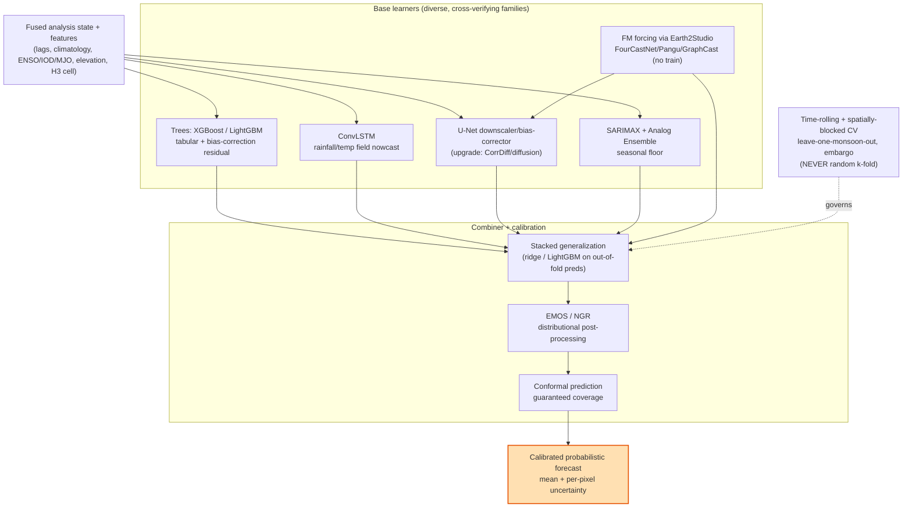

| Model | Family | Role in twin | How it cross-verifies others | Framework |
|---|---|---|---|---|
| **XGBoost / LightGBM** (#36/#37) | Trees (tabular) | Per-cell rainfall/temp from engineered features; **bias-correction** (predict obs−model residual); quantile/pinball intervals | Strong on point/tabular signals & nonlinear predictor interactions; outperformed ARIMA/SVM/ANN/RF in Indian rainfall studies; hard-to-beat floor | `xgboost`/`lightgbm` |
| **ConvLSTM** (#17) | Conv-recurrent | 0–6 h (extendable) rainfall & temperature **field** nowcasting over the pilot grid | Captures spatial fields & motion the trees can't; canonical, strong Indian precedent | `tf.keras ConvLSTM2D` / PyTorch |
| **U-Net downscaler/bias-corrector** (#21) | Encoder-decoder CNN | Coarse (ERA5/IMDAA/GraphCast) → high-res rainfall/temp; model→obs bias map; **temperature 1.0°→0.25° downscaling deliverable** | Field regression cross-check; upgrade path to **CorrDiff/diffusion** for sharp extremes | PyTorch (smp/MONAI) |
| **SARIMAX + Analog Ensemble** (#41+#43) | Classical stats | Per-station seasonal forecasts with exogenous ENSO/IOD/MJO indices; cheap probabilistic post-processing from IMDAA archive | Interpretable seasonality floor; AnEn instantly makes any member probabilistic | `statsmodels`, `PyAnEn` |
| **Combiner: stacking + EMOS + conformal** (#42/#45) | UQ / meta | Meta-learner (ridge/LightGBM) on **out-of-fold** base preds → consensus; EMOS/NGR for distributional calibration; conformal for guaranteed coverage | The whole point of the mandate — robust consensus that cross-verifies members and yields calibrated uncertainty | `MAPIE`, custom min-CRPS |

**Tier-2 (add if time/hardware allow):** pretrained **FourCastNet/SFNO + Pangu (+ GraphCast)** via **NVIDIA Earth2Studio** as global large-scale forcing (no training, ONNX/PyTorch); **ClimODE** (physics-informed, single-GPU, UQ); fine-tune **ClimaX / Prithvi WxC** (open weights); **DGMR/NowcastNet** for extreme-precip nowcasting; **TFT/PatchTST** for interpretable multi-horizon station forecasts.

**DA × ML hook (minimum viable):** start with a **MetNet-3-style fusion network** (observations as additional input channels) — it captures the *benefit* of DA (obs-aware dense fields) without a full assimilation cycle — then graduate to latent-space EnKF or FengWu-4DVar-style coupling at national scale.

### 6.3 Ensemble fusion (consensus engine)

1. **Stacked generalization (super-learner)** — meta-model on **out-of-fold** predictions only (no leakage); ridge/elastic-net for stability or LightGBM for nonlinear blending; can learn **per-regime weights** if an SOM synoptic-regime label is a meta-feature.
2. **EMOS / NGR** on the multi-model ensemble — calibrate combined mean + spread against obs by min-CRPS (rainfall: censored-shifted-Gamma; temperature: Gaussian) — the operational standard for the final probabilistic product.
3. **Conformal calibration** on top — distribution-free intervals with guaranteed coverage for threshold decisions (use blocked/adaptive variants for time series).
4. **Bayesian Model Averaging / performance weights** — optional richer predictive PDF.

### 6.4 Training data

- **IMDAA (12 km, hourly, 1979–2020)** — the **best India-specific gap-free reanalysis**; primary training substrate (outperforms ERA5 in wet-coastal/NE India).
- **BharatBench** (arXiv 2405.07534) and **IndiaWeatherBench** (arXiv 2509.00653) — ML benchmarks **built on IMDAA**; reuse their train/test splits and baselines so our results are directly comparable.
- **IMD gridded** rainfall/Tmax/Tmin as the **validation truth** (never leaked into training of the bias-corrector's residual target inappropriately).
- ERA5/ERA5-Land for additional forcing; WeatherBench 2 conventions where global comparability helps.

### 6.5 The cross-validation protocol (critical — never random k-fold)

Random k-fold leaks autocorrelation and understates error by up to 70–80%. We use:

| CV scheme | Tests | Implementation |
|---|---|---|
| **Rolling / expanding-window (forward-chaining)** | temporal generalization (train past → test future) | sklearn `TimeSeriesSplit`-style, expanding |
| **Spatially-blocked** | spatial transfer (hold out contiguous regions, block ≥ spatial autocorrelation range) | block by H3 res-2/3 tiles |
| **Leave-one-monsoon-season-out / leave-one-year-out** | inter-annual / monsoon-variability generalization | group by JJAS year |
| **Buffer / embargo gaps** | remove boundary leakage | temporal & spatial embargo |
| **Nested CV** | honest fused-ensemble skill (inner tunes base+meta, outer estimates) | nested loops |

Always report against **persistence + climatology + ≥1 NWP/FM baseline** (e.g., IMD operational, ERA5-driven GraphCast), stratified by season / region / lead time.

---

## 7. Fast-Platform / O(1) Serving Architecture

### 7.1 The core insight

A digital-twin dashboard never needs to *search* if you *address* data directly. Every query becomes a deterministic address computed with arithmetic in O(1) and fetched in one round-trip from the edge. Because the India grid is tiny, we **precompute everything** offline and serve constant-time.

### 7.2 Precompute pipeline → storage → edge

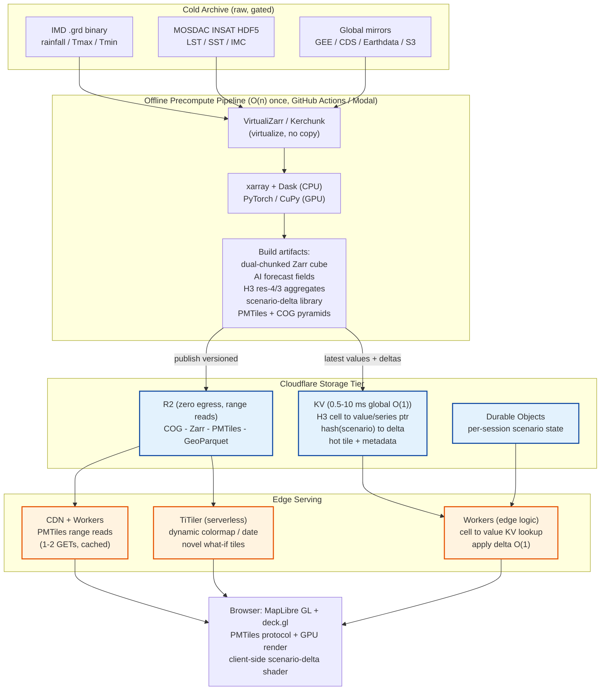

### 7.3 The dual-chunked Zarr cube (the make-or-break tuning knob)

The dashboard has **two access patterns in tension**:
- **Map view** = one date, all (lat, lon) → want `(time=1, lat=all, lon=all)` as one chunk.
- **Point time series** = one (lat, lon), all dates → want `(time=all, lat=small, lon=small)` as one chunk.

You cannot optimize both in one layout. **Solution (cheap because the grid is tiny): store two representations** — a **time-chunked cube** for series + a **space-chunked cube** (or the PMTiles pyramids) for maps. Zarr v3 with **consolidated metadata** reads the whole hierarchy in one GET; a hyperslab maps deterministically to exact chunk keys fetched in parallel (NOAA reported ~40× faster time-series access vs legacy formats).

```python
# space-chunked (map slices): one daily field = one chunk
ds.chunk({'time': 1, 'lat': -1, 'lon': -1}).to_zarr('cube_space.zarr', mode='w')
# time-chunked (point series): one cell's full series = one chunk
ds.chunk({'time': -1, 'lat': 8, 'lon': 8}).to_zarr('cube_time.zarr', mode='w')
```

### 7.4 The substrate at a glance

| Layer | Choice | Why it's O(1) / near-constant |
|---|---|---|
| Raw/cold | NetCDF/HDF virtualized by **VirtualiZarr/Kerchunk** | No re-encode; chunks read in-place, O(1)/chunk |
| Analysis cube | **Zarr v3**, consolidated meta, **dual chunking** | Hyperslab → exact chunk keys, parallel O(1)/chunk |
| Raster archive | **COG** (overviews) on R2 | Header + range GET = O(1)/tile |
| Spatial key | **Uber H3** (res 4 rain, res 3 temp, res 2 national) | `latLngToCell` = O(1); joins = int hash |
| Tabular/aggregates | **GeoParquet** sorted by H3/time, queried by **DuckDB** | Row-group pushdown ≈ O(matching groups) |
| Map tiles (stable) | **PMTiles** (raster + hex MVT) on R2 + CDN | `(z,x,y)`→Hilbert ID→byte range; 1–2 cached GETs |
| Map tiles (dynamic) | **TiTiler** serverless over COG, CDN-cached | O(1) bytes + edge cache hit on repeat |
| Point/scenario lookups | **Cloudflare KV** (`cell→value`, `scenario→result`) | hot read 0.5–10 ms, O(1) edge memory hit |
| What-if | **Precomputed deltas** + O(1) edge add; interpolate; GPU only for novel | lookup + trivial arithmetic = O(1) |
| Session state | **Durable Objects** | strong-consistent, routed to one PoP |
| Client render | **MapLibre + deck.gl** (WebGPU when stable) | GPU on client; server ships data, not pixels |

### 7.5 Query type → O(1) access path

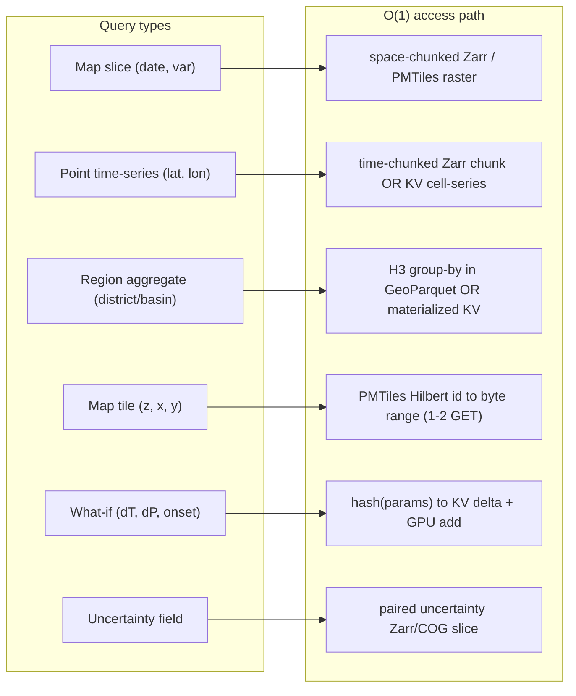

| Query type | Address computation | Access path | Cost |
|---|---|---|---|
| **Map slice** (date, var) | `(time index, var)` → chunk key | space-chunked Zarr chunk **or** pre-baked PMTiles | O(1) chunk / 1–2 GET |
| **Point time-series** (lat, lon) | `latLngToCell` → H3 cell ID | time-chunked Zarr chunk **or** KV `{cell→series}` | O(1) |
| **Region aggregate** (district/basin) | admin→H3-cell membership table | H3 group-by in GeoParquet (DuckDB) **or** materialized KV `{region,date→stat}` | O(1)/O(matching groups) |
| **Map tile** (z, x, y) | Hilbert TileId | PMTiles byte range from R2, CDN-cached | 1–2 GET, O(1) |
| **What-if** (ΔT, ΔP, onset) | `hash(params)` | KV delta + GPU shader add (client) | O(1) lookup + add |
| **Uncertainty field** | same address as value, paired layer | paired uncertainty Zarr/COG/PMTiles slice | O(1) |

**Why this is the fastest answer:** no search anywhere on the hot path; one round-trip served at the edge (R2 range reads + KV hot reads + CDN tile cache → typical interaction is a single sub-10 ms fetch from a nearby PoP, often no server compute); precompute kills the O(n) work; GPU on both ends (inference + rendering); serverless and cheap (R2 zero egress).

---

## 8. What-If Scenario Engine

### 8.1 Design — response-surface + precomputed scenario-delta library

The PS5 deliverable is a "what-if simulation module showing impacts of temperature or rainfall changes," and it is explicitly scored on feeling near-real-time. We implement the two interactive patterns from research doc 04 §4 / doc 05 §5 and reserve full physics for an async path:

1. **Precomputed scenario-delta library (instant lookup).** Offline, run the AI emulator over a **grid of canonical scenarios** — `ΔT ∈ {+1,+2,+3} °C` × `ΔP ∈ {−20,−10,0,+10} %` × `monsoon-onset shift ∈ {−10..+10} days}` — and store the resulting **delta fields** (scenario − baseline) in KV keyed by `hash(params)`.
2. **ML response surface (sub-second, off-grid).** Train a surrogate `f(drivers) → impact field` (Gaussian-process or small NN) on the library so off-grid slider positions are answered in milliseconds; alternatively **interpolate (lerp)** between nearest library members.
3. **Client-side GPU delta application.** For **linear** what-ifs (uniform shift/scale), the baseline field already lives in the browser as a texture; the slider applies the delta **in the fragment shader** so the map + charts update on every tick at 60 fps with **zero server latency**.
4. **Async high-fidelity path (credibility).** A "high-fidelity run" button enqueues a full **emulator perturbation** (modify forcing/IC, re-run ConvLSTM/U-Net or a Tier-2 FM) on Modal/ZeroGPU and streams progress/result via **SSE**, reconciling the optimistic client preview when it returns (DestinE "storyline" replay analog).

### 8.2 Interaction flow

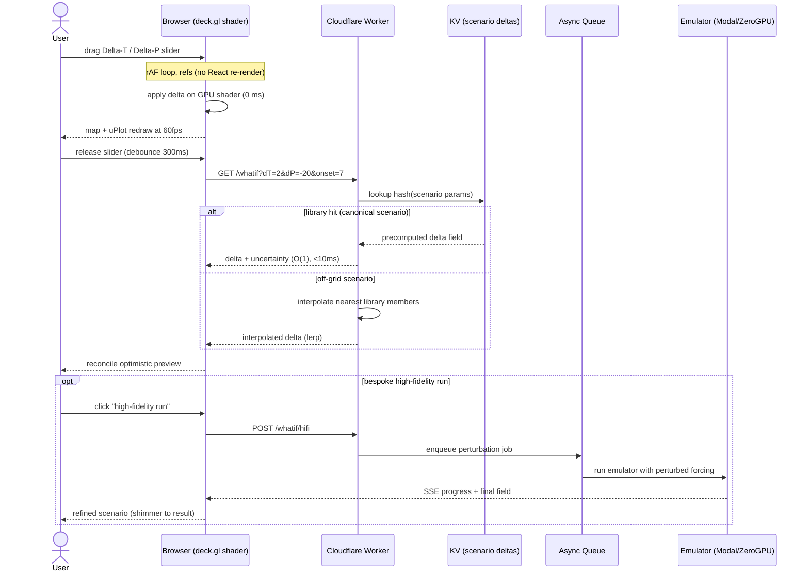

### 8.3 Example scenarios (PoC demo set)

| Scenario | Driver perturbation | What the twin shows | Engine path |
|---|---|---|---|
| **"+2 °C warming"** | `ΔT = +2` uniform (or spatially-varying) | shifted Tmax/Tmin fields, heat-day count (>40 °C), heatwave index | client GPU delta (instant) |
| **"−20 % monsoon rainfall"** | `ΔP = −20 %` over JJAS | reduced seasonal totals, SPI-3/SPI-6 drought intensification, consecutive-dry-days | library lookup + GPU |
| **"Monsoon onset shift +7 days"** | shift onset by +7 d | delayed accumulation curve, agricultural-window impact | response surface (off-grid) |
| **"Compound: +2 °C and −10 % rain"** | combined | compound drought-heat stress map with uncertainty | library/interp + optional hi-fi |
| **Counterfactual: "this flood without +1.5 °C"** | remove warming signal, re-run history | trajectory comparison (observed vs counterfactual) | async high-fidelity |

### 8.4 What-if module client architecture

```
slider drag ──(rAF, refs)──► apply Δ on GPU shader ──► map + uPlot redraw  (0 ms server)
        └──(debounced ~300ms, on release)──► GET/POST /whatif ──SSE──► AI-refined field ──► reconcile (optimistic)
```

(API shapes in §10.)

---

## 9. Visualization / Dashboard

### 9.1 The stack (opinionated)

| Concern | Choice | Why (1-liner) |
|---|---|---|
| App framework | **Next.js (App Router) + React + TypeScript** | Highest polish, React-native map ecosystem, fast iteration, edge deploy |
| Basemap engine | **MapLibre GL JS (BSD-3)** | Open, indigenous-friendly (not proprietary Mapbox), PMTiles + raster + v5 globe |
| Data/raster rendering | **deck.gl** via `MapboxOverlay({interleaved:true})` | GPU `BitmapLayer`/`H3HexagonLayer`/`HeatmapLayer`/`ContourLayer`, shared WebGL2 context |
| GPU colormap | Custom fragment shader (deck.gl-raster pattern) + 256×1 LUT texture | Instant colormap/rescale/scenario-delta on GPU |
| Heavy tiling backend | **TiTiler** (FastAPI + rio-tiler) + CDN | Dynamic COG tiles, colormaps, mosaics for national scale-up |
| Demo data delivery | **PMTiles** (raster) + typed-array/Zarr fields | Serverless, byte-range, demo never depends on a live server |
| Raster decode | `geotiff.js` (+ `zarr-js`) in a **Web Worker** | Off-main-thread COG/Zarr reads |
| Time-series charts | **uPlot** (live) + **ECharts** (rich panels) | Fastest live redraw (166k pts/25 ms) + polished comparison/climatology |
| What-if model | Precomputed deltas → **GPU client recompute**; rAF live + debounced commit; **SSE** for AI runs | Sub-frame slider feedback |
| Compare UX | **`maplibre-gl-compare`** swipe | Baseline-vs-scenario / observed-vs-predicted "wow" |
| State/data | **Zustand** (UI) + **TanStack Query** (server data) | Lightweight; plays well with imperative map updates |
| Backend API | **FastAPI** (heavier API; same backend can feed a Streamlit fallback) | Decoupled; Python-native |
| Deploy | **Cloudflare Pages** (or Vercel) + Workers + R2 | Fast, CDN-cached tiles |
| Fallback | **Streamlit + PyDeck** on the same FastAPI backend | 1-day Python-native demo if frontend time runs out |

**Why client-side rendering:** IMD pilot grids are tiny → keep the field in the browser → animate via per-timestep GPU textures and apply scenario deltas in a shader → the map *and* charts update at 60 fps with zero server latency. The **GPU colormap** in one sentence: upload data as a single-channel texture + a 256×1 colormap LUT; the fragment shader maps `value → normalized → texture2D(colormap, value)`, making colormap/rescale/scenario changes instantaneous.

### 9.2 Component tree

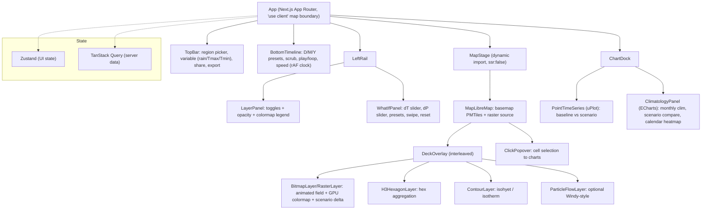

### 9.3 Layout & rendering pipeline

**Layout (map-first, full-bleed):** slim left rail (LayerPanel + WhatIfPanel) · big map stage · bottom timeline · docked charts. **Rendering pipeline:** data fetched as typed arrays (or PMTiles tiles) → deck.gl `BitmapLayer`/`RasterLayer` uploads a single-channel texture → fragment shader applies **GPU colormap LUT** + **scenario-delta** + alpha → MapLibre composites basemap + labels over the interleaved deck layer. Animation is driven by **one `requestAnimationFrame` clock** swapping a texture per timestep (throttled to the data cadence, colors interpolated between frames for smoothness). `updateTriggers` + binary attributes avoid full GPU-buffer rebuilds; `gpuAggregation: true` future-proofs national scale.

### 9.4 UX patterns borrowed (and exactly what we copy)

| Reference dashboard | Pattern we copy |
|---|---|
| **NASA Worldview** | Bottom **timeline** with D/M/Y range presets + drag-scrub + play/loop; **Layer List** with show/hide, reorder, per-layer opacity; **Comparison mode** (swipe/opacity); shareable permalinks (URL-encoded state) |
| **Windy / Ventusky / earth.nullschool** | Animated **GPU particle overlay** on a smooth color field (optional, maps to "monsoon variability"); **click-anywhere → popup time-series**; variable switcher; legend that doubles as a colormap key; minimal chrome |
| **Climate Engine / GEE Apps** | Slim **side-panel controls + big map**; "what-if = recompute on the fly"; threshold/scenario controls |

**Distilled checklist:** (1) map-first full-bleed; (2) bottom timeline with presets/scrub/play/speed; (3) layer panel (rainfall/Tmax/Tmin + H3-hex/contour/particle toggles, opacity, colormap legend, **uncertainty layer toggle**); (4) click-a-point → uPlot time-series + climatology, pin multiple points; (5) what-if panel (ΔT/ΔP sliders + presets, live update, before/after swipe, reset); (6) shareable URL state + export PNG/GIF; (7) skeletons + optimistic updates.

### 9.5 Frontend data-flow

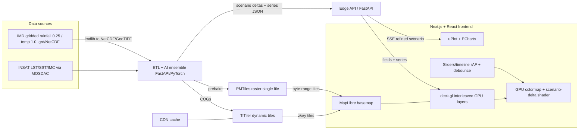

---

## 10. API Design

Two tiers: **edge endpoints** on Cloudflare Workers (O(1) reads of precomputed artifacts) and a **FastAPI** service for heavier/dynamic work (TiTiler tiles, bespoke inference). All responses are versioned (`?v=` or path prefix) so immutable artifacts are CDN-cached aggressively.

### 10.1 Endpoint catalog

| Method & path | Purpose | Key params | Response |
|---|---|---|---|
| `GET /tiles/{var}/{z}/{x}/{y}.png` | Pre-baked raster map tile | `var ∈ {rain,tmax,tmin,unc}`, `date`, `colormap`, `rescale` | PNG tile (PMTiles range or TiTiler) |
| `GET /point` | Value(s) at a point | `lat`, `lon`, `var`, `date?` | `{cell_id, lat, lon, var, value, uncertainty, date}` |
| `GET /timeseries` | Full series at a cell | `lat`, `lon`, `var`, `start`, `end` | `{cell_id, var, t:[...], value:[...], lower:[...], upper:[...]}` |
| `GET /region` | Region aggregate | `region_id` or `geometry`, `var`, `date`/`range`, `stat` | `{region_id, stat, value, uncertainty}` |
| `GET /uncertainty` | Uncertainty field/point | `lat,lon` or tile coords, `var`, `date` | paired value/σ (point) or PNG (tile) |
| `GET /climatology` | Long-term mean/anomaly | `lat`, `lon`, `var`, `baseline` | monthly climatology + anomaly arrays |
| `GET /whatif` | Interactive scenario delta | `dT`, `dP`, `onset`, `var`, `date` | `{params, delta_ref, field_url?, uncertainty}` (O(1) KV) |
| `POST /whatif/hifi` | Bespoke high-fidelity run | body: `{dT,dP,onset,region,model}` | `{job_id}` then **SSE** progress + result |
| `GET /scenarios` | List canonical library | – | `[{id, params, label}]` |
| `GET /catalog` | Layers/dates/variables | – | metadata (from KV/D1) |
| `GET /forecast` | Latest AI forecast frame | `var`, `lead`, `date` | tile URL / array + uncertainty |
| `GET /tiles.json` | TileJSON / PMTiles header | `var` | TileJSON spec |

### 10.2 Example response shapes

```jsonc
// GET /point?lat=18.4&lon=76.6&var=rain&date=2024-07-15
{
  "cell_id": "844c001ffffffff",   // H3 res-4
  "lat": 18.4, "lon": 76.6,
  "var": "rain", "unit": "mm/day",
  "date": "2024-07-15",
  "value": 42.7,
  "uncertainty": 6.1,             // 1-sigma from fusion + ensemble
  "sources_fused": ["IMD","IMERG","GSMaP","INSAT_IMC","ERA5Land"]
}
```

```jsonc
// GET /timeseries?lat=18.4&lon=76.6&var=tmax&start=2024-06-01&end=2024-06-30
{
  "cell_id": "843c001ffffffff",   // H3 res-3 for 1.0-deg temp
  "var": "tmax", "unit": "degC",
  "t":     ["2024-06-01", "2024-06-02", "..."],
  "value": [38.2, 39.1, "..."],
  "lower": [36.9, 37.7, "..."],   // conformal interval
  "upper": [39.5, 40.4, "..."]
}
```

```jsonc
// GET /whatif?dT=2&dP=-20&onset=7&var=rain&date=2024-08-01
{
  "params": { "dT": 2, "dP": -20, "onset": 7 },
  "scenario_hash": "a91f...c3",
  "match": "library",             // or "interpolated"
  "delta_ref": "r2://deltas/rain/dT2_dP-20_on7.cog",
  "field_url": "/tiles/whatif/{z}/{x}/{y}.png?scenario=a91f...c3",
  "uncertainty_url": "/tiles/whatif_unc/{z}/{x}/{y}.png?scenario=a91f...c3",
  "summary": { "mean_delta_pct": -18.4, "spi3_shift": -0.7 }
}
```

```jsonc
// POST /whatif/hifi  ->  {"job_id":"hifi_7f2"}   then SSE stream:
// event: progress  data: {"job_id":"hifi_7f2","pct":40,"stage":"emulator_step"}
// event: result    data: {"job_id":"hifi_7f2","field_url":"...","uncertainty_url":"..."}
```

---

## 11. Deployment & Infrastructure

### 11.1 Cloudflare edge architecture (free-tier-friendly, "O(1)-feeling")

**Primary stack: Cloudflare** — Pages (Next.js frontend on global CDN) + Workers (edge API + PMTiles range server) + R2 (COG/PMTiles/Zarr/GeoParquet, **zero egress**) + KV/D1 (metadata, catalog, station indexes) + Durable Objects (per-session scenario state). Heavy ML inference runs on **HF Spaces ZeroGPU / Modal**, or — preferred — is **precomputed offline** and served as static COG/JSON (fastest + cheapest).

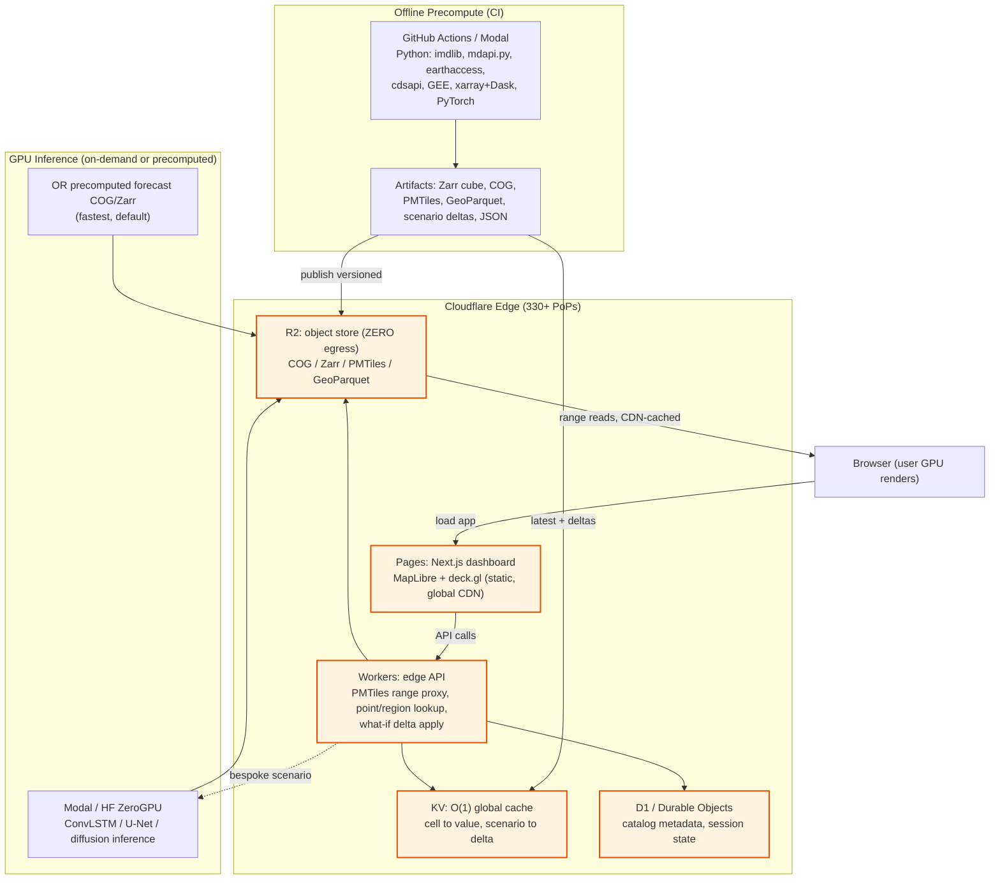

### 11.2 Free-tier feasibility

| Platform | Role | Free-tier (verified 2025–2026) | Verdict |
|---|---|---|---|
| **Cloudflare R2** | COG/PMTiles/Zarr store | 10 GB-month, 1M Class-A + 10M Class-B ops/mo, **egress FREE** | ✅ zero egress is the killer feature |
| **Cloudflare Workers** | Edge API / tile range server | ~100k req/day free; $5/mo → 10M req/mo | ✅ pair with R2 + KV |
| **Cloudflare Pages** | Static/Next.js frontend | unlimited static requests, 500 builds/mo | ✅ best home for the UI |
| **Cloudflare KV / D1** | Edge cache / metadata SQL | ample free tiers | ✅ catalog/station/cell indexes |
| **Vercel (Hobby)** | Alt Next.js host | 100 GB BW/mo, 1M edge req/mo, non-commercial | ⚠️ keep big tiles on R2 |
| **Google Cloud Run** | Containerized FastAPI/TiTiler | 2M req/mo, 180k vCPU-s, scales to zero | ✅ heavy xarray/GDAL API |
| **HF Spaces (ZeroGPU)** | Public ML demo + bursty GPU | free CPU; ZeroGPU (H200, Gradio only) | ✅ live inference demo |
| **Modal** | Serverless GPU inference/training | monthly free credits | ✅ custom PyTorch inference |

**Bottom line:** the entire PoC fits comfortably in free tiers because (a) the grid is tiny, (b) artifacts are precomputed and static, (c) R2 has zero egress, and (d) GPU is used in bursts or avoided via precompute.

### 11.3 GPU inference location

Default: **precompute forecast/anomaly/scenario layers offline** and serve as static COG/Zarr/JSON (fastest, cheapest, most demo-reliable). On-demand: **Modal** (custom PyTorch ConvLSTM/U-Net/diffusion) or **HF ZeroGPU** (public Gradio demo) for bespoke high-fidelity what-if runs only.

---

## 12. Product Repository Structure

A monorepo the build team creates. Concrete folder/file names; each top-level dir is independently runnable.

```
bah2026-ps5/
├─ README.md
├─ ARCHITECTURE.md                      # this document
├─ idea.md                              # problem statement (do not edit)
├─ research/                            # the six research docs (do not edit)
│   ├─ 01_satellite_eo_datasets.md
│   ├─ 02_fast_platform_o1_techniques.md
│   ├─ 03_ai_ml_climate_methods.md
│   ├─ 04_data_assimilation_digital_twin.md
│   ├─ 05_visualization_dashboard_whatif.md
│   └─ 06_data_access_infra_platforms.md
│
├─ data_pipeline/                       # L1-L2: acquire + harmonize (Python)
│   ├─ pyproject.toml                    # imdlib, xarray, xESMF, rioxarray, earthaccess, cdsapi, ee, h5py, dask
│   ├─ config/
│   │   ├─ pilot_regions.yaml            # Marathwada / Kerala bboxes + grids
│   │   ├─ sources.yaml                  # 40+ dataset access specs (asset IDs, buckets)
│   │   └─ mosdac_config.json            # mdapi.py credentials + product + bbox + dates
│   ├─ ingest/
│   │   ├─ imd_grd.py                     # imdlib + numpy.fromfile fallback reader
│   │   ├─ mosdac.py                      # mdapi.py wrapper (3RIMG_L2B_LST/SST/IMC)
│   │   ├─ earthaccess_imerg.py           # IMERG / MODIS / SMAP
│   │   ├─ cds_era5.py                    # ERA5 / ERA5-Land
│   │   ├─ gee_export.py                  # GEE co-grid + COG export
│   │   ├─ aws_open_data.py               # anon S3 (nsf-ncar-era5, himawari, sentinel-cogs)
│   │   └─ bhuvan_wris.py                 # OGC/WMS + India-WRIS REST
│   ├─ harmonize/
│   │   ├─ regrid.py                      # xESMF to 0.25-deg target grid
│   │   ├─ calendar_units.py              # daily UTC; K->C, mm/hr->mm
│   │   ├─ qc_mask.py                     # nodata masking, QC flags
│   │   └─ virtualize.py                  # VirtualiZarr/Kerchunk no-copy refs
│   └─ fuse/
│       ├─ bias_correct.py               # quantile mapping / CDF matching to IMD
│       ├─ triple_collocation.py         # TC error variances + fusion weights
│       ├─ oi_kriging.py                  # OI / Kriging-with-External-Drift merge
│       ├─ gap_fill.py                    # ERA5-Land/IMDAA/CHIRPS fill, DTC LST recon
│       └─ uncertainty.py                 # per-pixel uncertainty field assembly
│
├─ models/                              # L3: AI/ML ensemble + DA (Python/PyTorch)
│   ├─ pyproject.toml                    # torch, xgboost, lightgbm, statsmodels, MAPIE, earth2studio
│   ├─ features/
│   │   ├─ feature_engineering.py        # lags, climatology, ENSO/IOD/MJO, elevation, H3 cell
│   │   └─ datasets.py                    # BharatBench/IndiaWeatherBench splits (IMDAA)
│   ├─ base_learners/
│   │   ├─ trees.py                       # XGBoost/LightGBM (+ bias-corrector, pinball)
│   │   ├─ convlstm.py                    # ConvLSTM field nowcaster
│   │   ├─ unet_downscaler.py             # U-Net (upgrade hook: CorrDiff/diffusion)
│   │   ├─ sarimax_analog.py              # SARIMAX + Analog Ensemble
│   │   └─ fm_forcing.py                  # Earth2Studio FourCastNet/Pangu/GraphCast
│   ├─ combiner/
│   │   ├─ stacking.py                    # super-learner on out-of-fold preds
│   │   ├─ emos.py                        # EMOS/NGR min-CRPS
│   │   └─ conformal.py                   # conformal coverage (blocked/adaptive)
│   ├─ da/
│   │   ├─ oi_loop.py                     # DA-in-the-loop (analysis <-> forecast)
│   │   └─ enkf.py                        # stretch: 20-50 member EnKF -> LETKF path
│   ├─ cv/
│   │   └─ splits.py                      # rolling + spatially-blocked + leave-monsoon-out
│   ├─ train.py
│   ├─ predict.py
│   └─ evaluate.py                        # RMSE/MAE/bias/ACC, CSI/POD/FAR/ETS/FSS, CRPS/Brier, SSIM, EDI
│
├─ precompute/                          # L4: build serving artifacts (O(n) offline)
│   ├─ build_zarr_cube.py                # dual chunking (space + time)
│   ├─ build_cog.py                      # rio-cogeo per timestep + overviews
│   ├─ build_pmtiles.py                  # tippecanoe/pmtiles raster + hex MVT
│   ├─ build_h3_aggregates.py            # res 4/3/2 GeoParquet
│   ├─ build_scenario_library.py         # canonical ΔT×ΔP×onset delta grid
│   └─ publish_r2.py                     # versioned upload to R2 + KV seed
│
├─ backend/                             # L5: heavier API (FastAPI) + TiTiler
│   ├─ pyproject.toml
│   ├─ app/
│   │   ├─ main.py                        # FastAPI app
│   │   ├─ routers/{point,timeseries,region,whatif,forecast,catalog}.py
│   │   ├─ titiler_app.py                # dynamic COG tiles + custom colormaps
│   │   └─ sse.py                         # high-fidelity what-if SSE stream
│   └─ Dockerfile                        # for Cloud Run
│
├─ edge/                                # L5: Cloudflare Workers (TypeScript)
│   ├─ wrangler.toml                     # R2/KV/D1/DO bindings
│   └─ src/
│       ├─ index.ts                       # router
│       ├─ tiles.ts                       # PMTiles range proxy from R2
│       ├─ point.ts                       # H3 cell -> KV value lookup (O(1))
│       ├─ region.ts                      # region aggregate
│       ├─ whatif.ts                      # scenario hash -> KV delta (+ interp)
│       └─ session.ts                     # Durable Object scenario state
│
├─ frontend/                            # L6: Next.js dashboard (TypeScript)
│   ├─ package.json                      # next, react, maplibre-gl, deck.gl, uplot, echarts, zustand, @tanstack/query
│   ├─ next.config.mjs
│   ├─ app/
│   │   ├─ layout.tsx
│   │   └─ page.tsx                       # dashboard entry
│   ├─ components/
│   │   ├─ TopBar.tsx
│   │   ├─ LeftRail/{LayerPanel.tsx,WhatIfPanel.tsx}
│   │   ├─ MapStage.tsx                   # dynamic import ssr:false
│   │   ├─ map/{MapLibreMap.tsx,DeckOverlay.tsx,ClickPopover.tsx}
│   │   ├─ map/layers/{RasterField.tsx,H3Hex.tsx,Contour.tsx,ParticleFlow.tsx}
│   │   ├─ BottomTimeline.tsx
│   │   └─ ChartDock/{PointTimeSeries.tsx,ClimatologyPanel.tsx}
│   ├─ lib/
│   │   ├─ colormap.glsl                  # GPU colormap LUT + scenario-delta shader
│   │   ├─ pmtiles.ts                     # PMTiles protocol handler
│   │   ├─ api.ts                         # TanStack Query hooks
│   │   └─ store.ts                       # Zustand UI state
│   └─ public/colormaps/                 # 256x1 LUT PNGs
│
├─ infra/                               # IaC + CI
│   ├─ github-actions/{ingest.yml,precompute.yml,deploy.yml}
│   ├─ cloudflare/{pages.toml,r2-buckets.md}
│   └─ modal/{inference.py,deploy.md}
│
├─ scripts/
│   ├─ bootstrap_pilot.sh                # one-shot: ingest -> fuse -> precompute -> publish
│   ├─ refresh_daily.sh                  # cron: heartbeat cycle
│   └─ make_demo_pmtiles.sh             # bake demo timesteps (demo de-risk)
│
└─ tests/
    ├─ data_pipeline/{test_imd_grd.py,test_regrid.py,test_fuse.py}
    ├─ models/{test_cv_no_leak.py,test_metrics.py,test_conformal_coverage.py}
    ├─ edge/{tiles.test.ts,whatif.test.ts}
    └─ frontend/{map.test.tsx,whatif.test.tsx}
```

---

## 13. Tech Stack Summary

| Layer | Technology | Why |
|---|---|---|
| **Mandated data anchor** | IMD gridded `_Bin` via **`imdlib`** (+ numpy fallback) | Mandated truth; reads `.grd` directly to xarray; built-in SPI/SPEI/heatwave analytics |
| **Indian satellite** | **MOSDAC `mdapi.py`** (`3RIMG_L2B_LST/SST/IMC`) | Mandated INSAT integration; ISRO "badge" + compliance |
| **Global mirrors** | GEE, Copernicus `cdsapi`, NASA `earthaccess`, MPC STAC, anon S3 | Instant, cross-validating, gap-filling; fastest path to a working pipeline |
| **Regridding/harmonize** | `xarray`, `xESMF`, `rioxarray` | Conservative/bilinear remap to common 0.25° grid |
| **Virtualization** | **VirtualiZarr / Kerchunk** (+ Icechunk) | No-copy cube over raw NetCDF/HDF; versioned snapshots |
| **Fusion / DA** | Quantile mapping + **Triple Collocation** + **OI/Kriging-KED**; EnKF→LETKF path | BLUE-optimal, no adjoint, explainable; clean ensemble scale-up |
| **AI/ML base** | **XGBoost/LightGBM**, **ConvLSTM**, **U-Net** (→CorrDiff), **SARIMAX/AnEn** | Cross-verifying families; fast on modest hardware; strong India precedent |
| **AI/ML combiner** | Stacking + **EMOS** + **conformal** (`MAPIE`) | Calibrated consensus + guaranteed coverage |
| **FM forcing** | **NVIDIA Earth2Studio** (FourCastNet/Pangu/GraphCast) | Global physics priors with no training |
| **Compute** | `xarray`+`Dask` (CPU ingest); `PyTorch`/`CuPy` (GPU inference) | Offline O(n); results cached → O(1) reads |
| **Analysis cube** | **Zarr v3** (consolidated meta, dual chunking) | O(1)/chunk for both map slice and point series |
| **Raster archive** | **COG** (overviews) | O(1)/tile range reads; GDAL/TiTiler lingua franca |
| **Spatial key** | **Uber H3** (res 4/3/2) | O(1) point→cell; int-hash joins/aggregations |
| **Tabular** | **GeoParquet** (H3/time-sorted) + **DuckDB** | Row-group pushdown; columnar twin of Zarr |
| **Map tiles** | **PMTiles** (stable) + **TiTiler** (dynamic) | Serverless O(1) tiles; dynamic colormap/scenario long-tail |
| **Object store** | **Cloudflare R2** | S3-compatible, **zero egress**, range reads |
| **Edge cache/logic** | **Cloudflare KV + Workers + Durable Objects** | O(1) global lookups (0.5–10 ms); edge math; session state |
| **Frontend** | **Next.js + React + TypeScript** | Highest polish; React-native map ecosystem |
| **Basemap** | **MapLibre GL JS (BSD-3)** | Open/indigenous; PMTiles + raster + v5 globe |
| **GPU rendering** | **deck.gl** (interleaved) + custom shader | GPU colormap/aggregation/scenario-delta; server ships data not pixels |
| **Charts** | **uPlot** (live) + **ECharts** (rich) | Fastest live redraw + polished panels |
| **State** | **Zustand** + **TanStack Query** | Lightweight; imperative-map friendly |
| **Heavy API** | **FastAPI** | TiTiler + bespoke inference + SSE |
| **GPU inference host** | **Modal / HF ZeroGPU** or precompute | Bursty GPU or avoided entirely |
| **CI / IaC** | **GitHub Actions** / Modal; Wrangler | Reproducible ingest + precompute + deploy |

---

## 14. Build Roadmap

Phased plan; each phase ends with a demoable increment. "PoC" = hackathon deliverable; "National" = the scale-up vision the same code path supports.

| Phase | Goal | Key tasks | PoC exit criterion |
|---|---|---|---|
| **Phase 0 — Scaffold** | Monorepo + skeleton | Create repo structure (§12); pin deps; stub edge + frontend + FastAPI; CI pipelines; Cloudflare R2/KV/Pages provisioned; **start MOSDAC account application Day 1** | App shell deploys; empty map renders from a basemap PMTiles |
| **Phase 1 — Data ingestion** | Harmonized cube for Marathwada | `imd_grd.py` (IMD anchor) + IMERG/ERA5-Land/MODIS mirrors; regrid to 0.25°; QC; **quantile-map bias-correct**; **triple collocation**; **OI/KED merge** + uncertainty; cache raw `.grd` in R2 | Fused rainfall + temp analysis (value+σ) for one monsoon season over the pilot bbox; benchmarked vs MSWEP/IMD-merged |
| **Phase 2 — Models** | Cross-verifying forecasts | Tier-1 ensemble (XGBoost/LightGBM, ConvLSTM, U-Net downscaler, SARIMAX/AnEn) + stacking + EMOS + conformal; **time-rolling spatially-blocked CV**; evaluate vs persistence/climatology | Calibrated 1–7 day rainfall + temp forecasts with metrics table; temperature downscaled 1.0°→0.25° |
| **Phase 3 — Fast serving** | O(1) edge artifacts | Build dual-chunked Zarr + COG + **PMTiles** + H3 GeoParquet; seed **KV** (`cell→value`, latest); Workers for `point`/`region`/`tiles`; versioned publish to R2 | Map slice / point / region / tile all answered in one sub-10 ms edge fetch |
| **Phase 4 — Dashboard + what-if** | Interactive twin | Next.js + MapLibre + deck.gl (GPU colormap); timeline + uPlot/ECharts; **scenario-delta library** + GPU client deltas; before/after swipe; uncertainty layer; SSE high-fidelity path | Animated map, click-a-point series, ΔT/ΔP/onset sliders updating at 60 fps, swipe compare |
| **Phase 5 — Polish** | Demo-ready | Bake demo PMTiles (de-risk); shareable URL state; export PNG/GIF; impact alerts (drought/heat); pitch deck; fallback Streamlit | Reliable offline-capable demo; all 8 criteria visibly addressed |

**PoC vs national-scale vision:**

| Capability | PoC (hackathon) | National scale-up (same code path) |
|---|---|---|
| Region | Marathwada (+Kerala) | All-India, then basin/district granularity |
| DA | OI / Kriging-KED + optional small EnKF | EnKF → **LETKF** (grid-local, parallel) |
| Models | Tier-1 (5) + optional Earth2Studio forcing | + ClimaX/Prithvi WxC fine-tune, CorrDiff, DGMR/NowcastNet, latent/diffusion DA |
| Ingestion | offline CI batch | **Kafka + Flink** event-driven streaming |
| State store | dual-chunked Zarr + COG + PMTiles on R2 | + FDB-style hot store + data lake |
| Inference | precompute / bursty GPU | persistent GPU (Modal) + cached cube |
| Variables | rainfall + temperature | + soil moisture, ET, wind, air quality, hydrology |

---

## 15. Evaluation & Validation

### 15.1 Metrics

| Class | Metrics | Notes |
|---|---|---|
| **Deterministic (temperature, continuous)** | **RMSE** (primary), **MAE**, **Bias/ME**, **ACC** (vs climatology), R²/Pearson r | RMSE sensitive to extremes; bias key for bias-correction validation |
| **Precipitation categorical** (IMD thresholds 1, 2.5, 7.5, 15, 35, 64.5 mm/day) | **POD** = H/(H+M), **FAR** = F/(H+F), **CSI/Threat** = H/(H+M+F), **ETS** (random-adjusted), Frequency Bias, **HSS** | From 2×2 contingency tables; report across thresholds |
| **Spatial / field quality** | **FSS** (neighborhood, avoids double-penalty — *the* key spatial precip metric), **SSIM** (structural realism), PSNR, power-spectral skill | SSIM/PSD catch GAN/diffusion over-/under-sharpening |
| **Probabilistic / ensemble** | **CRPS** (headline), CRPSS, **Brier/BSS**, reliability & rank histograms, spread–skill ratio (≈1), pinball loss, **coverage/interval width** | CRPS optimizes EMOS; coverage validates conformal |
| **Extremes & drought** | **EDI/SEDI** (base-rate-independent), heavy-rain CSI/FSS at high thresholds, **SPI/SPEI** correlation + onset/duration error | EDI better than CSI for rare events |

### 15.2 Validation strategy against IMD observations

- **Truth:** held-out **IMD gridded** rainfall (0.25°) and Tmax/Tmin (1.0°) + **IMD AWS/ARG** points for downscaling validation.
- **Splits:** rolling/expanding-window + spatially-blocked + leave-one-monsoon-out + embargo (§6.5); nested CV for honest fused-ensemble skill.
- **Baselines:** always report skill vs **persistence + climatology + ≥1 NWP/FM** (IMD operational, ERA5-driven GraphCast).
- **Stratification:** report every metric by **season** (monsoon JJAS vs non-monsoon), **region**, and **lead time**.
- **Conventions:** **WeatherBench 2** where global comparability helps; **BharatBench/IndiaWeatherBench** splits for India-comparable numbers; **MSWEP v3** as the external benchmark for the fused rainfall product (matching/beating it regionally validates the fusion).
- **Uncertainty validation:** reliability diagrams + coverage tests confirm the per-pixel uncertainty is calibrated (a twin without *calibrated* uncertainty is just a map).

---

## 16. Risks & Mitigations

| # | Risk | Likelihood / Impact | Mitigation |
|---|---|---|---|
| 1 | **MOSDAC auth friction** (signup → manual approval; 3-fail lockout; 5000 files/day cap) | High / Medium | **Start the account application Day 1**; pull only a bounded sample window over the pilot bbox; cross-validate/model on **instant global mirrors** (MODIS LST for INSAT LST, NOAA MUR/OISST for SST, IMERG for cloud/rain). Keep MOSDAC as the "official INSAT badge" layer. |
| 2 | **IMD page/scraper changes** break `imdlib` download | Medium / Medium | Cache raw `.grd` in R2 (never re-scrape); **numpy.fromfile fallback** reader (Method B); **IRI Data Library** OPeNDAP mirror of IMD RF0p25 as backup. |
| 3 | **GPU availability** for training/inference | Medium / Medium | **Precompute** forecast/scenario layers offline and serve static (default); Tier-1 models train on CPU/single-GPU; bursty inference on **Modal / HF ZeroGPU**; FM forcing via Earth2Studio is **inference-only** (no training). |
| 4 | **Data gaps** (monsoon cloud loss in LST; satellite voids) | High / Medium | **Multi-source fusion (P1)**: microwave rain (IMERG/GSMaP/SMAP) + reanalysis fill (ERA5-Land/IMDAA) + **DTC-based cloud-gap LST reconstruction**; never serve a single-sensor field. |
| 5 | **CDS queue latency** for ERA5 | Medium / Low | Use **AWS `nsf-ncar-era5`** anon mirror or **GEE** for time-sensitive pulls. |
| 6 | **ML forecast limitations** (extreme smoothing, reanalysis dependence, physical-consistency) | Medium / Medium | Keep **observations in the loop** (DA); add a **generative** member (CorrDiff/diffusion) for extremes; **report calibrated uncertainty**; validate against held-out IMD; include a **physics-hybrid** member (ClimODE/NeuralGCM) as sanity bound. |
| 7 | **CV leakage** (spatiotemporal autocorrelation) understating error | Medium / High | **Never random k-fold**; rolling + spatially-blocked + leave-one-monsoon-out with **embargo**; nested CV; `test_cv_no_leak.py` guards it. |
| 8 | **Demo failure** on flaky stage Wi-Fi / live server down | Medium / High | **Pre-bake demo PMTiles** so the map renders from static byte-ranges; client-side fields/deltas need no server; CDN-cached immutable tiles. |
| 9 | **Vercel egress / Hobby non-commercial** limits | Low / Low | Keep big tiles/COG on **R2 (zero egress)**; host frontend on **Cloudflare Pages**; use Vercel only for the Next.js shell if chosen. |
| 10 | **deck.gl in Next.js SSR** (WebGL needs `window`) | Medium / Low | `dynamic(import, {ssr:false})` + `'use client'`; isolate all map imports from SSR. |
| 11 | **deck.gl-raster is 8-bit only / WebGPU not production-ready** | Low / Low | Hand-roll the float→LUT colormap shader (don't depend on the 8-bit lib); target **WebGL2 now**, treat WebGPU as a free future upgrade. |
| 12 | **Zarr + S3 small-chunk latency** at scale | Low / Medium | Use Rust Zarr backends (`zarrs`/`obstore`/`tensorstore`); dual-chunk sensibly; **TileDB** escape hatch if it ever bites. |
| 13 | **Triple-collocation invalidity** from non-independent triplets | Medium / Medium | Curate independent triplets only (IMD ⟂ IMERG ⟂ ERA5-Land); **never** pair ERA5/ERA5-Land or IMERG/CHIRPS-v3 as independent. |
| 14 | **Scope creep** beyond rainfall+temperature in the PoC | Medium / Medium | Lock PoC variables to **rainfall + temperature**; soil moisture/ET/wind/air-quality are documented **scale-up** dimensions only. |

---

### Closing note

This blueprint is internally consistent across all six research streams: the **data layer** (≥30 cross-validating sources, IMD-anchored, TC-validated, gap-filled, uncertainty-bearing) feeds the **two-stage Bayesian DA + AI ensemble core** (BLUE-optimal merge + 5 cross-verifying models + calibrated combiner, DA-in-the-loop), whose outputs are baked by the **offline precompute pipeline** into an **O(1) edge-served substrate** (dual-chunked Zarr + COG + PMTiles + H3 + KV on Cloudflare), surfaced through a **GPU-accelerated Next.js + MapLibre + deck.gl dashboard** with a **sub-second client-side what-if engine**, and validated rigorously against **IMD observations** with a leakage-free CV protocol — all on an **indigenous, open, free-tier-feasible** stack that scales cleanly from the Marathwada pilot to a national digital twin of India's climate.
