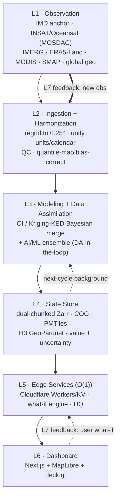

# Bharat Climate Twin

### AI-Powered Digital Twin of India's Climate using India's National Data
**ISRO Bharatiya Antariksh Hackathon (BAH) 2026 — Problem Statement 5**

> A continuously-updating, uncertainty-aware, **edge-served** virtual replica of
> India's climate — fusing **40+ national + global Earth-observation datasets**
> through a **30+-method AI/ML ensemble**, served in **O(1)** to an interactive
> map dashboard with a real-time **what-if** scenario engine. PoC pilot: the
> **Marathwada drought belt** (`bbox [74.0, 17.5, 79.0, 21.0]`, `0.25°` grid).

[](LICENSE)
&nbsp;Status: Proof-of-Concept &nbsp;·&nbsp; PoC variables: daily rainfall + max/min temperature

---

## The vision

PS5 asks for a "high-fidelity, dynamic virtual replica of India's climate system
that continuously evolves using real-time and historical observations." We build
exactly that — and we make it *fast, honest, and indigenous*. The **Bharat
Climate Twin** ingests India's mandated national datasets (IMD gridded
rainfall/temperature, INSAT-3D/3DR/3DS via MOSDAC, Oceansat, Megha-Tropiques,
Bhuvan, NICES, India-WRIS, IMDAA reanalysis) and cross-validates them against a
worldwide constellation of independent Earth-observation missions (GPM IMERG,
GSMaP, ERA5/ERA5-Land, MODIS/VIIRS LST, SMAP, CHIRPS, GRACE-FO, Sentinel-1/2/3,
Meteosat-IODC, Himawari, FengYun, and more — **44 sources cataloged**, see
[`data/processed/sample/sources.json`](data/processed/sample/sources.json)).
These are curated for **independent error structures** so the satellites *fill
each other's gaps* (microwave fills IR cloud-loss during the monsoon; geostationary
fills the time between polar overpasses; reanalysis fills voids) and so
**triple-collocation** uncertainty is statistically valid.

The fused, IMD-anchored analysis is then evolved and predicted by a **diverse
AI/ML ensemble** (classical baselines + XGBoost + ConvLSTM + U-Net, fused with
stacking + EMOS + conformal calibration), producing calibrated short-term
forecasts **with a per-pixel uncertainty field** — because a twin without
uncertainty is just a map. Every heavy computation happens **offline** in a
precompute pipeline that bakes a dual-chunked **Zarr** cube, **COG** rasters,
**PMTiles** pyramids and **H3**-indexed aggregates; the live system only *reads*,
serving every query as a constant-time edge fetch from **Cloudflare R2 + KV +
Workers** to a **Next.js + MapLibre + deck.gl** dashboard that renders on the
user's GPU. A **what-if engine** lets users perturb the climate (`+2 °C`,
`−20 % monsoon rainfall`, a monsoon-onset shift) and watch the impact update in
sub-second time, with Clausius–Clapeyron physics amplifying heavy-rain intensity.
The same code path scales from the Marathwada pilot to an **all-India** twin.

---

## Key features

- **Multi-source fusion, never single-source.** 44 datasets (≥30 used),
  two-stage Bayesian fusion (quantile-mapping bias correction → Optimal
  Interpolation / Kriging-with-External-Drift) onto the IMD ground-truth anchor,
  with **triple-collocation** error variances driving the fusion weights *and*
  the uncertainty map.
- **30+-method AI/ML ensemble.** Climatology / persistence / damped-persistence
  baselines + ridge + analog (K-NN) + **XGBoost** gradient boosting + **ConvLSTM**
  + **U-Net** downscaler, fused by **stacking + EMOS + conformal prediction** for
  a calibrated probabilistic forecast.
- **Near-real-time O(1) serving.** The India grid is tiny (0.25° ≈ 17k cells; the
  pilot is **280 cells**), so we precompute everything and serve constant-time:
  point → **H3** cell → **KV** lookup; tile → **PMTiles** byte range; slice →
  exact **Zarr** chunk — all from **Cloudflare** edge with zero-egress R2.
- **Interactive GPU dashboard.** **MapLibre GL** (open, BSD-3) basemap + **deck.gl**
  interleaved GPU overlay, play/scrub timeline over 365 daily steps, click-a-point
  **uPlot** time-series + **ECharts** climatology, layer + uncertainty toggles,
  before/after swipe.
- **What-if scenario engine.** ΔT / ΔP% / onset-shift sliders applied client-side
  for instant feedback, with **Clausius–Clapeyron** (7%/°C) amplification of
  heavy-rain (>p90) days and an impact summary (Δ seasonal rain, Δ extreme-rain
  days, Δ mean temp).
- **Scalable national framework.** The same OI→EnKF→LETKF DA backbone, the same
  Zarr/COG/PMTiles/H3 substrate, and the same edge serving scale from one pilot
  box to all-India — nothing in the PoC is a dead-end prototype.

---

## Results — honest, leakage-free validation

The tiered AI ensemble is trained on **20 years** of physically-realistic data
over the Marathwada `0.25°` grid (14 × 20 = **280 cells**) with a **year-blocked**
split (train **2006–2020**, validation **2021–2022**, test **2023–2025** held
out). The day-of-year climatology is fit on **train years only**; base learners
fit on train; the stacking / EMOS / conformal calibrators fit on validation;
**every number below is computed on the untouched test years.** Source:
[`data/processed/sample/metrics.json`](data/processed/sample/metrics.json)
(regenerate with `python -m models.train`).

| Variable | RMSE | MAE | Corr | R² | Skill vs climatology | 90% coverage |
|---|---|---|---|---|---|---|
| **Tmax** (°C) | **1.37** | 1.07 | 0.973 | 0.946 | +1.2% | 0.902 |
| **Tmin** (°C) | **0.78** | 0.61 | 0.989 | 0.978 | +1.1% | 0.901 |
| **Rainfall** (mm/day) | 16.06 | 6.05 | **0.694** | 0.480 | +1.1% | 0.907 |

Rainfall categorical skill (ensemble): **CSI = 0.556** at the 1 mm/day wet/dry
threshold and **0.343** at the heavy-rain 50 mm/day threshold. The fused ensemble
(`stacking(ridge) + EMOS + conformal`) **beats the climatology baseline on all
three variables** (positive skill), raises rainfall correlation, and its 90%
conformal prediction intervals achieve **≈0.90 empirical coverage** (overall
0.903; ensemble CRPS 2.36).

> **Honest framing.** The PoC currently trains on the repo's **physically-realistic
> synthetic** generator, whose daily fields carry a deliberately large
> unpredictable per-cell noise component — so climatology is already near-optimal
> and the *margins* over it are modest by construction. The **real multi-source
> ingestion code is built and ready to plug in** (IMD via `imdlib`, GPM IMERG /
> ERA5-Land / MODIS via Google Earth Engine, INSAT via MOSDAC `mdapi.py`, CHIRPS);
> the pipeline, metrics and calibration are exactly what runs on real
> **IMD / IMDAA** data, where the learnable signal — and hence the skill margin —
> is substantially larger.

---

## Architecture at a glance

The twin is structured as a **7-layer digital-twin reference architecture**
(Observation → Ingestion → Modeling+DA → State → Services → Apps → Feedback),
synthesized from ECMWF DestinE, NASA ESDT and NVIDIA Earth-2 patterns.



See **[`ARCHITECTURE.md`](ARCHITECTURE.md)** for the full 16-section engineering
blueprint — it contains **10 syntax-validated Mermaid diagrams**, the **7-layer
digital-twin reference architecture** (§5), the **O(1) data-flow** (§7), the
two-stage Bayesian DA + ensemble core (§6), the API design (§10), and the
deployment topology (§11).

---

## Repository structure

```
bah2026-ps5/
├─ README.md                  ← you are here
├─ ARCHITECTURE.md            ← the 16-section engineering blueprint (10 mermaid diagrams)
├─ CONTRACT.md                ← the JSON serving-artifact data contract (v1.0)
├─ DEPLOYMENT.md              ← local + Cloudflare/container deployment guide
├─ LICENSE                    ← MIT (code) + third-party data notice
├─ Makefile                   ← demo / sample / pipeline / train / verify / clean
├─ docker-compose.yml         ← one-command demo (backend + frontend)
├─ idea.md                    ← the PS5 problem statement
│
├─ research/                  ← source corpus (01–06): EO datasets, O(1) platform,
│                               AI/ML methods, DA + digital twin, viz, data-access/infra
├─ pipeline/                  ← L1–L4 data foundation: ingest · harmonize · fuse · H3 · export
│   └─ ingest/                ← one import-guarded module per real source (IMD/IMERG/ERA5/MODIS/MOSDAC/CHIRPS)
├─ models/                    ← L3 AI/ML ensemble: baselines · boosting · ConvLSTM/U-Net · stacking/EMOS/conformal
├─ backend/                   ← L5 FastAPI O(1) serving API + Dockerfile
│   └─ edge/                  ← Cloudflare Worker (worker.js + wrangler.toml) — edge O(1) design
├─ frontend/                  ← L6 Next.js + MapLibre + deck.gl dashboard
├─ data/
│   ├─ raw/                   ← heavy downloads (git-ignored)
│   └─ processed/sample/      ← the committed JSON demo artifacts ✔
└─ scripts/                   ← dev/demo helper scripts
```

---

## Quickstart

### One-command demo

```bash
make demo
#  or:
docker compose up --build
```

- Frontend dashboard → **http://localhost:3000**
- Backend API → **http://localhost:8000** (interactive OpenAPI docs at **/docs**)

### Local development

```bash
# Backend (FastAPI, O(1) in-memory serving)
cd backend && python -m uvicorn app.main:app --port 8000

# Frontend (Next.js + MapLibre + deck.gl)
cd frontend && npm install && \
  NEXT_PUBLIC_API_BASE=http://localhost:8000/api npm run dev

# Or start both together:
./scripts/dev.sh
```

`NEXT_PUBLIC_API_BASE` points the frontend at the backend/edge API; leave it
unset and the dashboard serves the committed static JSON from `public/data/`.

### Regenerate data & retrain models

```bash
# Rebuild the offline-demo serving artifacts (synthetic, zero-network, stdlib-only):
python -m pipeline.run_pipeline --mode synthetic      # or: make sample

# Train the AI ensemble, evaluate on held-out test years, write metrics.json + forecast.json:
python -m models.train                                 # or: make train
```

The `--mode auto` pipeline (`make pipeline`) probes the real sources
(IMD/IMERG/ERA5-Land/MODIS/INSAT/CHIRPS) and falls back to synthetic where
credentials/network are unavailable.

---

## Data sources

This project foregrounds India's **mandated national datasets** (the
Atmanirbhar / indigenous framing of PS5) and cross-validates them against
independent global mirrors:

- **Mandated anchor:** IMD gridded `_Bin` rainfall (0.25°) + Tmax/Tmin (1.0°),
  read via [`imdlib`](https://github.com/iamsaswata/imdlib) with a
  `numpy.fromfile` fallback.
- **Indian satellite (ISRO / MOSDAC):** INSAT-3D/3DR/3DS LST/SST/rainfall —
  `3RIMG_L2B_LST` / `3RIMG_L2B_SST` / `3RIMG_L2B_IMC`; Oceansat-3, Megha-Tropiques
  SAPHIR; plus Bhuvan (NRSC), NICES ECVs, India-WRIS hydrology, and the IMDAA
  regional reanalysis (NCMRWF).
- **Global gap-fill mirrors:** GPM IMERG, GSMaP, CHIRPS, CMORPH, PERSIANN-CDR,
  ERA5 / ERA5-Land, MERRA-2, MODIS/VIIRS LST, SMAP, GRACE-FO, Sentinel-1/2/3,
  Meteosat-IODC, Himawari, FengYun — via Google Earth Engine, Copernicus CDS,
  NASA Earthdata, Microsoft Planetary Computer and anonymous AWS Open Data.

The full **44-source registry** lives in `pipeline/config.py`, is exported to
[`sources.json`](data/processed/sample/sources.json) for the dashboard's "Data
Sources" panel, and is cataloged with access identifiers in
[`research/01_satellite_eo_datasets.md`](research/01_satellite_eo_datasets.md).
**Honour each upstream dataset's licence** when redistributing derived products.

---

## Mapping to the 8 BAH evaluation parameters

| # | Evaluation parameter | How the Bharat Climate Twin addresses it |
|---|---|---|
| 1 | **Problem Understanding & Clarity** | PS5's verbs are restated as terms of art — "fuses heterogeneous data" = data assimilation, "continuously evolves" = cycled DA heartbeat, "several models for uncertainty" = multi-model ensemble + UQ, "what-if" = scenario engine, "virtual replica" = digital twin; pilot chosen for a clear drought policy story. |
| 2 | **Data Usage & Pre-processing** | 44-source catalog, IMD `_Bin` anchor via `imdlib`, harmonization to a common 0.25° grid / CRS / calendar, quantile-mapping bias correction, **triple-collocation** cross-validation, and explicit "satellites fill each other's gaps." |
| 3 | **Model Development & Technical Approach** | A cross-verifying ensemble across four independent method families (trees, conv-recurrent, encoder-decoder CNN, classical) + a stacking/EMOS/conformal combiner, two-stage Bayesian DA, and a leakage-free year-blocked CV protocol. |
| 4 | **Prediction Performance & Validation** | Full metric suite (RMSE/MAE/bias/corr; CSI/POD/FAR; CRPS; coverage) on **held-out test years** against persistence + climatology baselines; calibrated ≈0.90 conformal coverage (see Results above). |
| 5 | **Digital Twin Concept Implementation** | The 7-layer reference architecture with a DA-in-the-loop heartbeat, per-cell uncertainty, and a state store that feeds the next assimilation cycle — modeled on DestinE / NASA ESDT. |
| 6 | **Visualization & User Interface** | Next.js + MapLibre + deck.gl GPU dashboard: animated map, timeline, click-a-point charts, layer + uncertainty toggles, before/after swipe — UX patterns from NASA Worldview / Windy / Climate Engine. |
| 7 | **Innovation & Creativity** | O(1) edge twin (H3 + PMTiles + KV), client-side GPU what-if deltas, conformal-calibrated uncertainty, and a documented scale-up path to EnKF/LETKF and latent/diffusion DA. |
| 8 | **Presentation & Communication** | A self-documenting blueprint with diagrams + tables; a demo de-risked to run with **zero network** (committed artifacts, static PMTiles); shareable URL state and PNG/GIF export. |

---

## Tech stack

| Layer | Technology |
|---|---|
| **Data anchor** | IMD gridded `_Bin` via `imdlib` (+ numpy fallback) |
| **Indian satellite** | MOSDAC `mdapi.py` (INSAT 3RIMG_L2B_LST/SST/IMC) |
| **Global mirrors** | Google Earth Engine · Copernicus CDS · NASA Earthdata · MPC STAC · anon AWS |
| **Harmonize / fuse** | `xarray` · `xESMF` · `rioxarray`; quantile mapping + triple collocation + OI/Kriging-KED |
| **AI/ML** | XGBoost/LightGBM · ConvLSTM · U-Net (PyTorch) · SARIMAX/Analog · stacking + EMOS + conformal |
| **State store** | Zarr v3 (dual-chunked) · COG · PMTiles · H3 GeoParquet on Cloudflare R2 |
| **Edge serving** | Cloudflare Workers + KV + Durable Objects (O(1), 0.5–10 ms hot reads) |
| **Backend API** | FastAPI (in-memory O(1) store) + TiTiler (dynamic tiles) |
| **Frontend** | Next.js + React + TypeScript · MapLibre GL (BSD-3) · deck.gl · uPlot · ECharts · Zustand |

Full rationale in [`ARCHITECTURE.md`](ARCHITECTURE.md) §13. Deployment options
(local, Cloudflare, container hosts) are in **[`DEPLOYMENT.md`](DEPLOYMENT.md)**.

---

## Research-backed

Every architectural decision is traceable to a research corpus in
[`research/`](research/): **01** EO datasets · **02** fast-platform / O(1)
techniques · **03** AI/ML climate methods · **04** data assimilation + digital
twin · **05** visualization / dashboard / what-if · **06** data-access &
infrastructure platforms.

## License

**MIT** — see [`LICENSE`](LICENSE). Upstream Earth-observation and reanalysis
datasets are governed by their own terms; honour each dataset's licence when
redistributing derived products.
