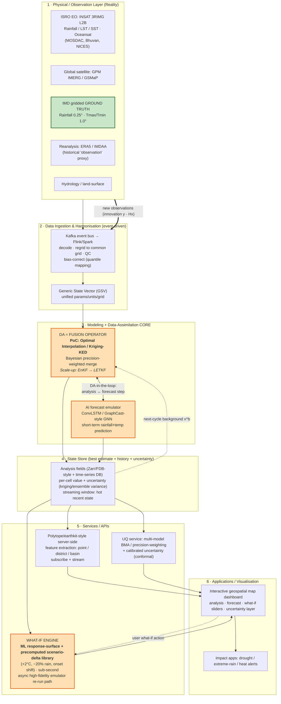

# Data Assimilation Methods & Digital-Twin Architectures for India's Climate Digital Twin

**Project:** ISRO BAH 2026 — PS5 "AI-Powered Digital Twin of India's Climate"
**Scope of this document:** (1) Data assimilation (DA) methods incl. ML-based DA, (2) Digital-twin architecture patterns for Earth/climate, (3) Uncertainty quantification & multi-model integration, (4) "What-if" / scenario engine design, (5) Continuous / streaming update. Ends with a **layered reference architecture for our twin** and a **pragmatic PoC recommendation**.
**Date:** 2026-06-21 · **Research window prioritised:** 2023–2026

> **TL;DR for the PoC.** Use a **two-stage fusion**: (a) **bias-correct** each gridded source (INSAT/IMERG satellite, ERA5 reanalysis) against IMD gauge-grids by quantile mapping, then (b) **merge** them into a single best-estimate analysis with **Optimal Interpolation (OI) / Kriging-with-external-drift** — mathematically a 1-step Kalman/BLUE update, cheap and explainable. Layer an **Ensemble Kalman Filter (EnKF)–style** light cycling on top *only if time permits* (it gives flow-dependent uncertainty + ensemble spread "for free"). For the forecast/twin core, use an **ML emulator (ConvLSTM / GraphCast-style)** and run DA "**in the loop**" (analysis → emulator step → next analysis). The **what-if engine** is an **ML response-surface + precomputed scenario-delta library** for sub-second interactivity, with a slower "high-fidelity" perturbation path for credibility.

---

## Part 0 — Why DA + Digital Twin are the heart of PS5

PS5 explicitly asks for a *"high-fidelity, dynamic virtual replica … that continuously evolves using real-time and historical observations … integrates several climate models to consider uncertainty … fuses heterogeneous datasets (INSAT/Oceansat, IMD ground, reanalysis, hydrology) … near-real-time climate states and predictive scenarios … 'what-if' simulation."* Every one of those verbs is a DA + digital-twin term of art:

- **"fuses heterogeneous datasets" / "near-real-time climate states"** → *data assimilation* (optimal combination of model background + observations weighted by their errors).
- **"continuously evolves"** → *cycled / streaming assimilation* (state synchronisation loop).
- **"integrates several models to consider uncertainty"** → *multi-model ensemble + uncertainty quantification*.
- **"what-if simulation"** → *scenario / counterfactual engine*.
- **"virtual replica"** → *digital twin* (a model kept in lock-step with reality by observations, queryable and perturbable).

A digital twin is precisely **"a fusion of numerical simulations and observations to create a virtual replica which is indistinguishable from reality"** ([ECMWF DestinE explainer](https://stories.ecmwf.int/explainer-digitaltwins/index.html)). DA is the *fusion* operator that makes the replica track reality; the what-if engine is what makes it a *twin* (you can perturb it) rather than a dashboard.

---

## Part 1 — Data Assimilation Methods

### 1.0 The common framework (read this first)

All DA methods solve the same Bayesian estimation problem: given a model **background / first guess** $x^b$ (prior, error covariance $B$) and **observations** $y$ (error covariance $R$, observation operator $H$ mapping model state → observation space), produce the **analysis** $x^a$ (posterior). For linear-Gaussian assumptions the optimal (BLUE) update is:

$$x^a = x^b + K(y - Hx^b), \qquad K = BH^{T}(HBH^{T} + R)^{-1}$$

where **K** is the *Kalman gain*. **Every method below is a different way of representing/propagating B, handling nonlinearity of H or the model M, and managing cost.** This unifying view is what lets us start simple (OI) and scale up (EnKF/Var) without redesigning the twin.

For our PoC, the "observations" are: **IMD gauge-gridded rainfall (0.25°) and max/min temperature (1.0°)** (the ground truth), and the "background/extra sources" are **INSAT rainfall/LST/SST (MOSDAC), satellite IMERG/GSMaP, and ERA5 reanalysis**. DA gives us a principled way to merge them by their respective error characteristics rather than naive averaging.

---

### 1.1 Optimal Interpolation (OI) / Statistical Interpolation

- **What it does:** A *single-time* BLUE update with a **static, prescribed** background-error covariance $B$ (often modelled as a correlation function of distance × a variance), usually solved **locally** (only nearby obs influence each grid point). This is exactly the engine inside most operational satellite–gauge rainfall *merging* schemes (e.g., CPC/IMD-style "first-guess + gauge correction").
- **Cost:** **Very low.** Local solves are small linear systems; embarrassingly parallel per grid cell. Runs on a laptop for a pilot region.
- **When to use:** First choice for a PoC / spatial fusion of gridded products. Mature, explainable, robust.
- **How it fuses satellite + gauge + reanalysis:** Treat a satellite/reanalysis field as the **first guess (background)**; treat **IMD gauge grids as observations**; OI corrects the first guess toward the gauges with weights set by error variances and a spatial correlation length. PDF/quantile-matching bias-correction is applied to the first guess *before* merging. This is the canonical 2-step "error-correct first guess, then merge with obs" pipeline. ([MDPI review of satellite–gauge merging](https://www.mdpi.com/2673-4834/3/4/72))
- **Refs:** OI is listed among the eight standard merging methods (Multiple Linear Regression, Residual IDW, OI, Random-Forest merging, BMA, Kriging, …) in the [MDPI Geomatics review (2023)](https://www.mdpi.com/2673-4834/3/4/72); ocean-DA context in [Tellus "4D-Var or EnKF?"](https://tellusjournal.org/articles/907/files/submission/proof/907-1-40643-1-10-20220829.pdf).

### 1.2 Kriging-family (Ordinary Kriging, Regression Kriging, Kriging with External Drift)

- **What it does:** Geostatistical interpolation that is **formally equivalent to OI** (kriging weights = BLUE weights when the variogram encodes $B$). **Kriging with External Drift (KED)** / **Regression Kriging** use the satellite/reanalysis field as a *covariate/drift*, so the merged field follows satellite spatial patterns but is anchored to gauges — ideal for gappy gauge networks.
- **Cost:** Low–moderate (variogram fitting + local kriging). Scales fine for a pilot region; national daily fields need tiling/local kriging.
- **When to use:** When you want a spatially smooth, uncertainty-aware merge and you have a good covariate (INSAT/IMERG). KED is a top performer for India-type gauge densities.
- **Fusion:** Gauges = data; satellite = drift/covariate; output = analysis + **kriging variance map** (free uncertainty estimate — great for the dashboard).
- **Refs:** [MDPI merging review](https://www.mdpi.com/2673-4834/3/4/72); India context — [Kumar et al. 2022, *Earth & Space Science*, long-term gauge-adjusted satellite rainfall over India](https://agupubs.onlinelibrary.wiley.com/doi/full/10.1029/2022EA002595).

### 1.3 3D-Var (Three-Dimensional Variational)

- **What it does:** Minimises a **cost function** $J(x)=\tfrac12(x-x^b)^TB^{-1}(x-x^b)+\tfrac12(y-Hx)^TR^{-1}(y-Hx)$ over the whole domain at one time. Gives the same answer as OI/BLUE but via optimisation, so it scales to huge state vectors and handles **nonlinear H** (e.g., radiance/satellite operators) and physical constraints/balance.
- **Cost:** Moderate. Needs an iterative minimiser + adjoint of $H$. Background $B$ is still **static** (climatological), which is its main limitation.
- **When to use:** Operational large-scale NWP; when you need nonlinear observation operators (assimilating raw radiances) but can't afford 4D-Var.
- **Fusion:** Add each data source as a term in $J$ with its own $H$ and $R$ — natural multi-sensor fusion.
- **Refs:** [Tandfonline EnKF vs 3DVAR over complex terrain](https://www.tandfonline.com/doi/full/10.3402/tellusa.v65i0.19620); [ScienceDirect 3DVAR vs hybrid radar DA for heavy rain](https://www.sciencedirect.com/science/article/abs/pii/S0169809522000485).

### 1.4 4D-Var (Four-Dimensional Variational)

- **What it does:** 3D-Var extended over a **time window**: finds the initial state whose model *trajectory* best fits all observations in the window, using the model itself as a strong/weak constraint. This is the **gold standard** of operational NWP (ECMWF IFS) and gives flow-dependent corrections implicitly.
- **Cost:** **Very high.** Requires the **tangent-linear and adjoint** of the full forecast model — "a challenging and effort-intensive task for large-scale models" — plus many forward/backward integrations. **Not realistic for a hackathon.**
- **When to use:** Full operational centres with adjoint-capable models. For us: aspirational / scale-up only.
- **Fusion:** Best-in-class temporal + multi-sensor fusion (uses obs at their true times).
- **Refs:** [Tellus "4D-Var or EnKF?" (2022)](https://tellusjournal.org/articles/907/files/submission/proof/907-1-40643-1-10-20220829.pdf); [NOAA strongly-coupled 4D-Var report](https://repository.library.noaa.gov/view/noaa/48167/noaa_48167_DS1.pdf).

### 1.5 Kalman Filter (KF) & Extended Kalman Filter (EKF)

- **What it does:** **Sequential** Bayesian update that *propagates* the error covariance $P$ through time via the model (unlike OI's static $B$). **KF** is exact for linear model+H; **EKF** linearises a nonlinear model/H about the current state.
- **Cost:** $P$ is $n\times n$ for state size $n$ → **infeasible to store/propagate** for gridded climate fields ($n\sim10^6$+). EKF also needs Jacobians and can diverge for strong nonlinearity. → Pure KF/EKF used only for **low-dimensional** sub-problems (e.g., a single-cell soil-moisture or temperature state, parameter estimation).
- **When to use:** Small state vectors; point/station-level temporal filtering; teaching baseline.
- **Refs:** Foundational; covered in all DA reviews above. EnKF (next) is the scalable Monte-Carlo replacement.

### 1.6 Ensemble Kalman Filter (EnKF) and Ensemble Square-Root Filters (EnSRF/ETKF)

- **What it does:** Represents the background error covariance by a **small ensemble** ($N\sim$ 20–100) of model states; the sample covariance gives a **flow-dependent B** without storing the full matrix. **EnSRF/ETKF** are *deterministic* variants that update the ensemble without perturbing observations (lower sampling noise). **Localisation** (limit obs impact to a radius) and **inflation** (counter under-spread) are mandatory.
- **Cost:** Moderate and **tractable**: cost scales with ensemble size, not $n^2$. Ensemble runs are embarrassingly parallel. This is the **practical sweet spot** between OI and 4D-Var, and the natural way to get **ensemble spread / uncertainty**.
- **When to use:** When you want flow-dependent uncertainty + a cycled twin and can afford an ensemble of (cheap, ML or reduced-physics) forecasts. **Strong fit for an AI digital twin** because the "model" can be a fast ML emulator.
- **Fusion:** Each observation type enters via its $H$/$R$; ensemble naturally blends satellite + gauge + reanalysis and yields per-cell uncertainty.
- **Refs:** [Tellus "4D-Var or EnKF?"](https://tellusjournal.org/articles/907/files/submission/proof/907-1-40643-1-10-20220829.pdf) (EnKF competitive with/better than 4D-Var, far cheaper to maintain); EnKF beats 3DVAR over complex terrain ([Tandfonline](https://www.tandfonline.com/doi/full/10.3402/tellusa.v65i0.19620)).

### 1.7 LETKF (Local Ensemble Transform Kalman Filter)

- **What it does:** The most widely used **operational EnKF**. Does the analysis **independently at each grid point** using only nearby observations (explicit localisation), combining results into a global ensemble. Update is computed in **ensemble space** (dimension $N$, not $n$).
- **Cost:** Cost of the core linear algebra is **proportional to the cube of the ensemble size** $O(N^3)$ — cheap because $N$ is small — and it is **massively parallel** (each grid column independent). Localisation lets it work with "drastically fewer ensemble members." ([SWSC LETKF paper](https://www.swsc-journal.org/articles/swsc/full_html/2019/01/swsc180038/swsc180038.html); [Kotsuki & Miyoshi 2020, QJRMS](https://rmets.onlinelibrary.wiley.com/doi/10.1002/qj.3852))
- **When to use:** Scale-up DA core for the national twin; the standard if we adopt an ensemble approach. Originated in [Hunt et al. 2007](https://journals.ametsoc.org/abstract/journals/mwre/135/11/2007mwr1873.1.xml) ("7-step" efficient implementation).
- **Fusion:** Same as EnKF; localisation makes multi-source assimilation over India scalable.

### 1.8 Particle Filters (PF) and hybrids

- **What it does:** Fully **non-Gaussian, nonlinear** Bayesian filter using weighted samples (particles). No Gaussian assumption — attractive for **rainfall** (highly non-Gaussian, bounded at 0).
- **Cost:** Suffers **filter degeneracy / curse of dimensionality** — needs exponentially many particles in high dimensions. Pure PF impractical for gridded climate; **localised/hybrid PFs** (e.g., LWEnKF = PF+EnKF; IEWVPS = PF+4D-Var) make it tractable. ([MDPI hybrid DA, South China Sea, 2025](https://www.mdpi.com/2073-4433/16/10/1193))
- **When to use:** Strongly nonlinear/non-Gaussian sub-systems; research scale-up. Overkill for the PoC.
- **Refs:** [Implicit particle filtering (arXiv)](https://arxiv.org/pdf/1109.3664); hybrid PF methods in [MDPI 2025](https://www.mdpi.com/2073-4433/16/10/1193).

### 1.9 Hybrid En-Var (Ensemble-Variational)

- **What it does:** Combines the **flow-dependent B from an ensemble** (EnKF) with the **robust, constrained minimisation of Var** (3D/4D-Var). The background covariance is a blend $\alpha B_{static} + (1-\alpha) B_{ensemble}$. Now standard at ECMWF/NCEP/Met Office.
- **Cost:** High (Var machinery + ensemble), but **best skill**: "hybrid DA methods better predict mesoscale eddies across short- and long-term timescales" vs EnKF or 4D-Var alone. ([MDPI 2025](https://www.mdpi.com/2073-4433/16/10/1193); [ScienceDirect 3DVAR vs hybrid](https://www.sciencedirect.com/science/article/abs/pii/S0169809522000485))
- **When to use:** Mature operational target; **not** for a hackathon PoC.

---

### 1.10 Modern ML-based Data Assimilation (2023–2026) — the frontier

This is where the "AI-powered" framing of PS5 is most defensible. Key families:

**(a) ML forecast model *inside* a classical DA cycle ("DA in the loop" with an emulator).** Replace the expensive physical forecast model $M$ with a fast neural emulator (GraphCast/FourCastNet/AIFS-style), then run EnKF/Var around it. Note that **operational ML forecast models today still take their initial conditions from a conventional DA analysis** — e.g., **ECMWF's AIFS** (GNN encoder–decoder + sliding-window transformer, trained on ERA5) "relies on traditional NWP analyses as initial conditions" and runs ~**1000× cheaper in energy** than IFS ([ECMWF AIFS newsletter](https://www.ecmwf.int/en/newsletter/178/news/aifs-new-ecmwf-forecasting-system); [AIFS paper arXiv:2406.01465](https://arxiv.org/pdf/2406.01465); [AIFS operational, Feb 2025](https://www.ecmwf.int/en/about/media-centre/news/2025/ecmwfs-ai-forecasts-become-operational)). Demonstrations of EnKF/Var **with an ML surrogate as the model** include FourCastNet-in-the-loop ([arXiv:2405.13180](https://arxiv.org/html/2405.13180v1)).

**(b) Latent-space DA.** Compress the high-dimensional state with an autoencoder and **assimilate in the low-dimensional latent space**, where Gaussian assumptions hold better and cost collapses. 2025 milestone: **"Physically consistent global atmospheric data assimilation with machine learning in latent space"** (*Science Advances*, 2025) ([science.org/doi/10.1126/sciadv.aea4248](https://www.science.org/doi/10.1126/sciadv.aea4248)); foundational concept in [Peyron et al., "DA in the Latent Space of a Neural Network"](https://www.semanticscholar.org/paper/eb57971a35b53182abafe5679d946b58e142f78a). Latent methods "improve both accuracy and efficiency."

**(c) Score-based / diffusion DA.** Use a diffusion model as a learned **prior** and condition on observations to sample the posterior — naturally non-Gaussian, gives ensembles. Examples: **DiffDA** (diffusion DA at weather scale, 2024); **Latent-EnSF / LD-EnSF** (latent ensemble *score* filters for sparse obs, 2024–25, [arXiv:2411.19305](https://arxiv.org/pdf/2411.19305)); **LO-SDA** ([arXiv:2510.22562](https://arxiv.org/pdf/2510.22562)); **Align-DA** ([arXiv:2505.22008](https://arxiv.org/pdf/2505.22008)); **training-free DA with GenCast** ([arXiv:2509.18811](https://arxiv.org/pdf/2509.18811)). **GenCast** itself is a diffusion ensemble (15-day, 0.25°, 80+ vars, 8 min, beat ECMWF ENS on 97.2% of targets — [DeepMind/Nature 2024](https://deepmind.google/blog/gencast-predicts-weather-and-the-risks-of-extreme-conditions-with-sota-accuracy/); [arXiv:2312.15796](https://arxiv.org/pdf/2312.15796)).

**(d) Generative / deep-ensemble DA for hydrology.** [Foroumandi 2025, *Water Resources Research*](https://agupubs.onlinelibrary.wiley.com/doi/full/10.1029/2025WR040078) — generative deep learning to enhance ensemble DA; directly relevant to hydrology fusion in PS5.

**(e) Learned observation operators / surrogates.** The obs operator $H$ (e.g., radiative transfer) is a bottleneck; ML emulators/correctors speed it up ([Howard 2024, JAMES](https://agupubs.onlinelibrary.wiley.com/doi/full/10.1029/2023MS003774); [learned inverse obs operator, arXiv:2102.11192](https://arxiv.org/pdf/2102.11192)). Strategic overview: **Geer, "Learning earth system models from observations: ML or data assimilation?"** and [Geer's ECMWF lecture, 2024 (PDF)](https://research.reading.ac.uk/met-darc/wp-content/uploads/sites/48/2024/05/da_ml_reading_2024.pdf); broad survey: ["AI techniques in data assimilation," *Science China Earth Sciences* 2025](https://link.springer.com/article/10.1007/s11430-025-1807-8).

**(f) Caveat for the demo's credibility.** [Bonavita 2024 (GRL)](https://www.articsledge.com/post/ai-weather-forecasting) and the ML-vs-DA debate note current ML models have **limitations** (smoothing of extremes, dependence on reanalysis training, physical-consistency questions). Mitigation: keep observations in the loop (DA), report uncertainty, validate against held-out IMD data.

---

### 1.11 DA method selection matrix (for PS5)

| Method | Handles non-Gaussian? | Flow-dependent B? | Gives ensemble/UQ? | Cost | Hackathon-feasible? | Role in our twin |
|---|---|---|---|---|---|---|
| **OI / Kriging (KED)** | No (Gaussian) | No (static) | Variance map only | **Very low** | ✅✅✅ | **PoC fusion core** |
| Simple Bayesian fusion (precision-weighted) | No | No | Per-cell variance | **Very low** | ✅✅✅ | PoC alt./complement |
| 3D-Var | Partial (nonlinear H) | No | No | Med | ⚠️ (needs adjoint of H) | Scale-up |
| 4D-Var | Partial | Implicit | No | **Very high** | ❌ | Long-term only |
| KF/EKF | No | Yes (small n) | Yes | High for large n | ⚠️ point-scale only | Station filtering |
| **EnKF / EnSRF** | Approx | **Yes** | **Yes (spread)** | Med | ✅ (with ML model) | **Stretch goal in PoC** |
| **LETKF** | Approx | **Yes** | **Yes** | Med, parallel | ⚠️/✅ | **National scale-up core** |
| Particle / hybrid PF | **Yes** | Yes | Yes | High (degeneracy) | ❌ | Research |
| Hybrid En-Var | Partial | **Yes (best)** | Yes | High | ❌ | Operational target |
| ML latent / diffusion DA | **Yes** | Yes | Yes (samples) | Low *inference*, high *training* | ⚠️ (use pretrained) | Innovation showcase |

---

## Part 2 — Digital-Twin Architecture Patterns for Earth/Climate

### 2.1 Reference systems studied

**(A) Destination Earth (DestinE) — EU, implemented by ECMWF + ESA + EUMETSAT.** Went live 10 June 2024 from LUMI. Two flagship twins:
- **Climate Change Adaptation DT (Climate DT):** first operational global **km-scale** (5–10 km) multi-decadal projections (1990–2049), hourly output, using models **ICON, IFS-FESOM, IFS-NEMO**; directly-linked **impact-sector applications** (wind energy on/offshore, wildfire, hydrology, extreme precipitation); QC via **AQUA**; supports **storyline simulations** ("replay events under past/present/warmer climates") = built-in what-if. ([ECMWF Climate DT](https://www.ecmwf.int/en/forecasts/dataset/destination-earth-digital-twin-climate-change-adaptation); [DestinE Climate DT](https://destine.ecmwf.int/climate-change-adaptation-digital-twin-climate-dt/); [GMD paper 2026](https://gmd.copernicus.org/articles/19/2821/2026/)).
- **Weather-Induced & Geophysical Extremes DT:** km-scale prediction for risk assessment/management.
- **The "Digital Twin Engine" internals** (very relevant pattern for us): model output is standardised into a **Generic State Vector (GSV)** (unified parameters/units/grid); stored in the **FDB (Fields DataBase)** and exposed via a **GSV interface**; **Data Bridges** (one per HPC, run by EUMETSAT as the "data lake") hold data for a **streaming window**; **Polytope** does server-side feature extraction from data hypercubes (point/region/country) to cut access time to sub-selections; **earthkit-data** is the client access library. Paradigm: **"bring users to the data"** + **stream while running** rather than download static files. ([Polytope](https://destine.ecmwf.int/news/polytope-navigating-destination-earth-digital-twins-data-deluge/); [Digital Twin Engine](https://stories.ecmwf.int/the-digital-twin-engine/); [Implementing DT tech in DestinE, ScienceDirect 2025](https://www.sciencedirect.com/science/article/pii/S2950630125000092); [Data-retrieval APIs PDF](https://destination-earth.eu/wp-content/uploads/2024/05/Destination-Earth-Data-Retrieval-APIs-Earthkit-Polytope-and-more.pdf)).

**(B) NASA Earth System Digital Twin (ESDT).** Defines an ESDT as *"a dynamic, interactive information system that provides a digital replica of past and current states of the Earth, allows computing forecasts of future states, and offers the capability to investigate hypothetical scenarios under varying impact assumptions."* **Three components: (1) continuously-updated Digital Replica, (2) dynamic Forecasting models, (3) Impact Assessment / what-if.** Architecture is "organised around interconnected, multi-domain, high-scale modeling capabilities" with interfaces to external observing systems/models. Led by the AIST program; prototypes incl. a Coastal Zone DT (NASA/NOAA/CNES). ([NASA ESDT framework, NTRS 20230015584](https://ntrs.nasa.gov/citations/20230015584); [ESDT prototypes, NTRS 20240000303](https://ntrs.nasa.gov/citations/20240000303); [ESTO ESDT](https://esto.nasa.gov/earth-system-digital-twin/)). NOAA + NVIDIA built an **AI-based EO-DT** prototype ([NOAA EO-DT final report 2024/25 PDF](https://www.nesdis.noaa.gov/s3/2025-01/LM-NVIDIA-EODT-FinalReport-dmg-final-20250110.pdf)).

**(C) NVIDIA Earth-2 / Omniverse / Modulus.** Climate digital twin built on two pillars — **Modulus** (physics-ML training) and **Omniverse** (simulation/visualisation). **FourCastNet** (Fourier transformer) and **Earth-2 APIs** (on DGX Cloud) serve **FourCastNet, GraphCast, DLWP** pipelines; CorrDiff-style generative **downscaling** to km-scale. Up to ~5 orders of magnitude faster than IFS for the ML emulator. ([NVIDIA Earth-2](https://www.nvidia.com/en-us/high-performance-computing/earth-2/); [Earth Climate DT announce 2024](https://nvidianews.nvidia.com/news/nvidia-announces-earth-climate-digital-twin)).

**(D) Google / DeepMind weather.** **GraphCast** (deterministic GNN) and **GenCast** (diffusion ensemble) — state-of-the-art ML forecasting; relevant as the *forecast engine* and *ensemble generator* of a twin ([GenCast](https://deepmind.google/blog/gencast-predicts-weather-and-the-risks-of-extreme-conditions-with-sota-accuracy/)).

**(E) ECMWF AIFS / AIFS-ENS.** Operational ML forecasting (deterministic Feb 2025; **AIFS-ENS** 51-member ensemble July 2025), still initialised from conventional analysis ([ECMWF ensemble AI operational](https://www.ecmwf.int/en/about/media-centre/news/2025/ecmwfs-ensemble-ai-forecasts-become-operational)).

**(F) Generic DT reference architectures.** DDDAS-style **feedback loops + state management**; time-series DB / data-lake persistence; schema/metadata registries; physical → ingestion → processing/modeling → state → services/viz → feedback layering ([Digital Twin Earth, *Frontiers in Science* 2024](https://www.frontiersin.org/journals/science/articles/10.3389/fsci.2024.1383659/full); [TwinEco ecology DT, ScienceDirect 2025](https://www.sciencedirect.com/science/article/pii/S1574954125004169); [IETF Network DT reference architecture](https://www.ietf.org/archive/id/draft-irtf-nmrg-network-digital-twin-arch-07.html); [DT data/architecture review, PMC](https://pmc.ncbi.nlm.nih.gov/articles/PMC10912257/)).

### 2.2 The distilled layered reference architecture (synthesis)

Across DestinE, NASA ESDT, the *Frontiers* DTE editorial and generic DDDAS DTs, the **same 7 layers** recur:

1. **Physical / Observation layer** — the real Earth + sensors (satellite EO, ground networks, reanalysis as a proxy "observation" of the past).
2. **Data ingestion & harmonisation layer** — collect, decode, regrid, QC, standardise (DestinE's **GSV** is the archetype: one format, units, grid).
3. **Modeling + Data-Assimilation core** — physical/ML models + DA fusing obs into state (the "fusion of simulations and observations").
4. **State store** — the *current best estimate* of the Earth state + history (FDB / time-series store / data lake), with uncertainty.
5. **Services / APIs layer** — query, feature-extract, subscribe (DestinE **Polytope/earthkit**); the "bring users to the data" + streaming-window pattern.
6. **Applications / visualisation layer** — dashboards, impact-sector models, map UI.
7. **Feedback / continuous-update loop** — new obs → re-assimilate → update state (DDDAS); plus user actions (what-if) → re-simulate.

### 2.3 The continuous-update / state-synchronisation loop

DestinE describes a framework that **"continuously monitors and evaluates the simulations and quantifies uncertainties using observations and machine learning"**, with users able to **"read and capture information while the digital twins are running."** Generalised loop:

```
observe → ingest/harmonise → assimilate (analysis) → forecast step (model/emulator)
   ↑                                                                   │
   └───────────────  compare to next observations  ←──────────────────┘
                     (innovation y - Hx drives next update)
```

This is the heartbeat that turns a model into a *twin*: the **innovation** $(y - Hx^b)$ at each cycle measures how far the replica has drifted from reality and corrects it.

---

## Part 3 — Uncertainty Quantification (UQ) & Multi-Model Integration

PS5 requires "integrate several climate models to consider uncertainty sources." Approaches, from simple to rich:

- **Ensemble spread (intra-model).** EnKF/LETKF/diffusion ensembles give per-cell spread directly. **Caution:** raw ensemble spread is typically **over-confident**; needs calibration/inflation or correction factors ("estimations based on ensemble spread without correction result in overconfident predictions"). ([Climate projection UQ, arXiv:2408.06642](https://arxiv.org/html/2408.06642v1))
- **Multi-model combination (inter-model).**
  - **Simple/weighted mean** of models — baseline.
  - **Bayesian Model Averaging (BMA)** — weights each model by predictive skill in a baseline period; yields a full predictive PDF. ([Quantifying model uncertainty with Bayesian multi-model ensembles, ScienceDirect](https://www.sciencedirect.com/science/article/abs/pii/S136481521830731X); [BMA vs REA for runoff, MDPI Water](https://www.mdpi.com/2073-4441/13/15/2124))
  - **Reliability Ensemble Averaging (REA)** — weights by model performance + convergence.
  - **Statistical frameworks to reduce MME uncertainty** for precipitation ([Climate Dynamics 2025](https://link.springer.com/article/10.1007/s00382-025-07867-6)); **comprehensive review of aggregation methods** ([ScienceDirect 2026](https://www.sciencedirect.com/science/article/abs/pii/S1474706526001245)).
  - **Conformal prediction** for distribution-free, calibrated intervals — modern, easy to bolt on ([conformal ensembles, arXiv:2408.06642](https://arxiv.org/html/2408.06642v1)); **deep ensembles** for ENSO UQ ([arXiv:2512.17153](https://arxiv.org/pdf/2512.17153)).
- **DA's intrinsic UQ.** The analysis-error covariance $A=(I-KH)B$ (or ensemble posterior) is a *built-in* uncertainty product — expose it on the dashboard (e.g., kriging variance map).
- **Sources of uncertainty to name (NASA/DTE taxonomy):** *forcing* (e.g., precipitation input), *parameter* (e.g., soil/land properties), *structural/model*, and *computational/numerical*. ([Frontiers DTE 2024](https://www.frontiersin.org/journals/science/articles/10.3389/fsci.2024.1383659/full))

**PoC recommendation:** combine 2–3 sources (IMD-merged analysis, ERA5, INSAT/IMERG) with **precision-weighted Bayesian fusion** (weights ∝ 1/error-variance) for the *analysis*, and **BMA or simple skill-weighting** if combining multiple *forecast* models; show a **per-cell uncertainty map** + reliability metric. Calibrate with held-out gauges.

---

## Part 4 — "What-If" / Scenario Simulation Engine

DestinE's design goal: *"on-demand bespoke simulations to address 'what-if' questions … real-time, on-demand responses to policy questions, with quantified uncertainty,"* with **AI emulators and chatbots** for "flexible scenario exploration." ([DestinE Climate DT news](https://destine.ecmwf.int/news/climate-change-adaptation-digital-twin-a-window-to-the-future-of-our-planet/)). NASA ESDT: "investigate hypothetical scenarios under varying impact assumptions." Four implementable patterns:

1. **Physics/emulator perturbation (high fidelity, slow).** Modify forcings/initial conditions (+2 °C, −20 % rainfall, monsoon-onset shift by ±N days) and **re-run the model/emulator**. With an **ML emulator** this drops from hours to seconds (FourCastNet/GraphCast inference). This is the most credible but not sub-second.
2. **Statistical sensitivity / delta method (instant).** Precompute **response gradients** $\partial(\text{output})/\partial(\text{driver})$; a scenario = baseline + (delta × gradient). Cheap, transparent, good for small perturbations. "Delta-change" is standard in climate impact work.
3. **ML response surfaces / emulators of the scenario map (sub-second).** Train a surrogate $f(\text{drivers}) \to \text{impact field}$ on a sample of full runs (Gaussian-process or NN). Querying it is **milliseconds** → true interactive sliders. This is the recommended interactive path.
4. **Precomputed scenario library (instant lookup).** Run a **library** of canonical scenarios offline (e.g., grid of ΔT ∈ {+1,+2,+3} × ΔP ∈ {−20,−10,0,+10} % × onset shift), store as deltas; the UI **interpolates** between library members. DestinE's **"storyline" replays** are this pattern (replay an event under warmer climate). Mix with (3) for off-grid queries.

**Counterfactual simulation** = a special what-if: re-run history with a driver removed/changed (e.g., "this flood *without* the +1.5 °C warming") — operationally identical to perturbing initial/forcing fields and comparing trajectories.

**Keeping it interactive (sub-second):** serve (3)/(4) from the **state store + a precomputed delta cache**; reserve (1) for an async "high-fidelity run" button. Architecture: slider event → response-surface inference (or library interpolation) → render on map, with the full-physics path queued for verification.

---

## Part 5 — Continuous / Streaming Update

How to ingest near-real-time observations and update the twin (event-driven, incremental):

- **Event-driven ingestion.** New obs (INSAT granule on MOSDAC, IMD update, IMERG late/early run) arrive as **events** on a message bus (**Apache Kafka**), consumed by stream processors (**Apache Flink / Spark Structured Streaming**) with **event-time semantics + exactly-once** delivery; orchestration via **Airflow** for batch backfills. ([ESTemd Kafka env-monitoring, arXiv:2104.01082](https://arxiv.org/pdf/2104.01082); [streaming + event-driven analytics](https://mitzu.io/post/designing-analytics-stack-with-streaming-and-event-driven-architecture/); [Octopus hybrid event-driven scientific computing, arXiv:2407.11432](https://arxiv.org/pdf/2407.11432)).
- **Incremental / cycled assimilation.** Don't recompute from scratch — run DA on a **fixed cycle** (e.g., daily for the PoC, hourly at scale): take the latest forecast as background, assimilate newly-arrived obs, write the new analysis to the state store. EnKF/LETKF are naturally **sequential/incremental**; OI is a cheap per-cycle solve. (Continuous DA studied even for LES via [LBM-LETKF, arXiv:2308.03972](https://arxiv.org/pdf/2308.03972).)
- **Streaming-window / state store.** Follow DestinE: keep recent state hot in a fast store (the FDB analog) with a **streaming window**; expose via a **Polytope-style** server-side feature-extraction API so the dashboard pulls only the point/region it needs.
- **Latency tiers.** *Hot path* (event → quick OI nudge → dashboard, seconds-minutes) vs *warm path* (scheduled full re-analysis + forecast, per cycle). This gives "near-real-time climate states" without a supercomputer.

---

## Part 6 — RECOMMENDED LAYERED REFERENCE ARCHITECTURE (our twin)



**Layer-by-layer choices and justification:**

| Layer | Our choice (PoC) | Scale-up | Why |
|---|---|---|---|
| 1 Observation | INSAT (MOSDAC) + IMERG + **IMD gridded as ground truth** + ERA5 | + Oceansat, IMDAA, AWS networks | Mandated national datasets; IMD = anchor truth |
| 2 Ingestion | Python (xarray/regrid) + quantile-mapping bias-correct; **GSV-style** common grid | Kafka + Flink event-driven | Harmonisation is prerequisite to fusion |
| 3 **DA core** | **Optimal Interpolation / Kriging-with-External-Drift** (+ optional light EnKF) | **EnKF → LETKF** | Cheap, explainable, BLUE-optimal; clean path to ensemble UQ |
| 3 Forecast | **ConvLSTM / GraphCast-style** emulator, **DA-in-the-loop** | FourCastNet/AIFS-class | "AI-powered"; 1000× cheaper than physics ([AIFS](https://www.ecmwf.int/en/newsletter/178/news/aifs-new-ecmwf-forecasting-system)) |
| 4 State store | **Zarr / NetCDF + time-series DB**, value+uncertainty, streaming window | FDB-style + data lake | Fast slice access for map; history for what-if |
| 5 Services | **Polytope/earthkit-style** extraction API; **what-if** = response-surface + delta library; **UQ** = BMA/precision-weighting + conformal | server-side hypercube extraction | Sub-second interactivity ("bring users to data") |
| 6 Apps/Viz | Map dashboard + sliders + uncertainty layer + impact alerts | impact-sector models coupled | Required deliverables (dashboard + scenarios) |
| 7 Feedback | Daily cycle: state→background→re-assimilate; user action→re-simulate | hourly cycled DA | The loop that makes it a *twin*, not a dashboard |

---

## Part 7 — PRAGMATIC PoC RECOMMENDATION (implementable this hackathon)

**Chosen DA approach — "Two-stage Bayesian fusion (OI/KED) with optional EnKF cycling":**
1. **Harmonise** INSAT/IMERG/ERA5 to the IMD 0.25° grid; **bias-correct** each against IMD gauges via **quantile mapping** (handles rainfall's skew).
2. **Merge** into one analysis with **Optimal Interpolation / Kriging-with-External-Drift** — equivalently a **precision-weighted Bayesian** combine (weight ∝ 1/error-variance, error variances estimated from validation against IMD). Output includes a **per-cell uncertainty map** for free.
3. **Forecast** rainfall + temperature 1–7 days with a **ConvLSTM / lightweight GNN emulator**; run **DA-in-the-loop** (assimilate the next day's obs into the forecast background to produce the next analysis) — this is the live "twin heartbeat."
4. *(Stretch)* Wrap the emulator in a small **EnKF (20–50 members)** to get flow-dependent, calibrated **ensemble spread**; this is the credible bridge to **LETKF** at national scale.

*Why this and not 4D-Var/hybrid En-Var:* OI/KED is **BLUE-optimal under the same assumptions**, needs **no adjoint model**, runs on a laptop, is fully explainable to judges, and is *literally the method operational centres use to merge satellite+gauge rainfall* ([MDPI review](https://www.mdpi.com/2673-4834/3/4/72); [India gauge-adjusted product](https://agupubs.onlinelibrary.wiley.com/doi/full/10.1029/2022EA002595)). It scales cleanly: OI→EnKF→LETKF share the same Kalman-gain backbone.

**Chosen what-if engine — "Response-surface + precomputed scenario-delta library":**
- Offline, run the emulator over a **grid of canonical scenarios** (ΔT, ΔP%, monsoon-onset shift), store **deltas**.
- At runtime, the dashboard sliders query an **ML/GP response surface** (or interpolate the library) → **sub-second** updated impact map with uncertainty.
- Provide an **async "high-fidelity re-run"** button (full emulator perturbation) for credibility on bespoke scenarios — mirrors DestinE's on-demand "storyline" replays.

**Innovation hooks to mention (judging "Innovation & Creativity"):** DA-in-the-loop with an ML emulator; latent-space / diffusion DA as the stated scale-up (cite *Science Advances* 2025, GenCast, DiffDA); GSV/Polytope-style streaming services; conformal-calibrated uncertainty. Keep observations in the loop to counter known ML-forecast limitations ([Bonavita 2024](https://www.articsledge.com/post/ai-weather-forecasting)).

---

## Sources (key)

**DA methods & ML-DA:** [Tellus 4D-Var vs EnKF](https://tellusjournal.org/articles/907/files/submission/proof/907-1-40643-1-10-20220829.pdf) · [EnKF vs 3DVAR complex terrain](https://www.tandfonline.com/doi/full/10.3402/tellusa.v65i0.19620) · [Hybrid DA, MDPI 2025](https://www.mdpi.com/2073-4433/16/10/1193) · [3DVAR vs hybrid radar](https://www.sciencedirect.com/science/article/abs/pii/S0169809522000485) · [LETKF SWSC](https://www.swsc-journal.org/articles/swsc/full_html/2019/01/swsc180038/swsc180038.html) · [LETKF weights, Kotsuki 2020](https://rmets.onlinelibrary.wiley.com/doi/10.1002/qj.3852) · [Hunt et al. 2007 LETKF](https://journals.ametsoc.org/abstract/journals/mwre/135/11/2007mwr1873.1.xml) · [Implicit particle filter](https://arxiv.org/pdf/1109.3664) · [Latent-space DA, Science Advances 2025](https://www.science.org/doi/10.1126/sciadv.aea4248) · [DA in latent space (Peyron)](https://www.semanticscholar.org/paper/eb57971a35b53182abafe5679d946b58e142f78a) · [LD-EnSF](https://arxiv.org/pdf/2411.19305) · [LO-SDA](https://arxiv.org/pdf/2510.22562) · [Align-DA](https://arxiv.org/pdf/2505.22008) · [Training-free DA w/ GenCast](https://arxiv.org/pdf/2509.18811) · [FourCastNet+DA case study](https://arxiv.org/html/2405.13180v1) · [Generative ensemble DA, WRR 2025](https://agupubs.onlinelibrary.wiley.com/doi/full/10.1029/2025WR040078) · [ML-augmented DA, JAMES 2024](https://agupubs.onlinelibrary.wiley.com/doi/full/10.1029/2023MS003774) · [Learned inverse obs operator](https://arxiv.org/pdf/2102.11192) · [Geer DA+ML lecture 2024](https://research.reading.ac.uk/met-darc/wp-content/uploads/sites/48/2024/05/da_ml_reading_2024.pdf) · [AI in DA survey, Sci China 2025](https://link.springer.com/article/10.1007/s11430-025-1807-8)

**Satellite–gauge fusion:** [MDPI merging review 2023](https://www.mdpi.com/2673-4834/3/4/72) · [India gauge-adjusted satellite rainfall, Kumar 2022](https://agupubs.onlinelibrary.wiley.com/doi/full/10.1029/2022EA002595) · [Double-ML merging](https://www.sciencedirect.com/science/article/abs/pii/S0022169421000160) · [LightGBM extreme-quantile merging](https://arxiv.org/pdf/2302.03606) · [IMERG/GSMaP over India, PMC](https://www.ncbi.nlm.nih.gov/pmc/articles/PMC6821882/)

**Digital-twin systems & architecture:** [ECMWF Climate DT dataset](https://www.ecmwf.int/en/forecasts/dataset/destination-earth-digital-twin-climate-change-adaptation) · [DestinE Climate DT](https://destine.ecmwf.int/climate-change-adaptation-digital-twin-climate-dt/) · [DestinE explainer (DT definition)](https://stories.ecmwf.int/explainer-digitaltwins/index.html) · [Digital Twin Engine](https://stories.ecmwf.int/the-digital-twin-engine/) · [Polytope](https://destine.ecmwf.int/news/polytope-navigating-destination-earth-digital-twins-data-deluge/) · [Implementing DT tech in DestinE 2025](https://www.sciencedirect.com/science/article/pii/S2950630125000092) · [GMD Climate DT paper 2026](https://gmd.copernicus.org/articles/19/2821/2026/) · [NASA ESDT framework](https://ntrs.nasa.gov/citations/20230015584) · [NASA ESDT prototypes](https://ntrs.nasa.gov/citations/20240000303) · [NASA ESTO ESDT](https://esto.nasa.gov/earth-system-digital-twin/) · [NOAA EO-DT (NVIDIA) report](https://www.nesdis.noaa.gov/s3/2025-01/LM-NVIDIA-EODT-FinalReport-dmg-final-20250110.pdf) · [NVIDIA Earth-2](https://www.nvidia.com/en-us/high-performance-computing/earth-2/) · [NVIDIA Earth Climate DT 2024](https://nvidianews.nvidia.com/news/nvidia-announces-earth-climate-digital-twin) · [GenCast (DeepMind)](https://deepmind.google/blog/gencast-predicts-weather-and-the-risks-of-extreme-conditions-with-sota-accuracy/) · [GenCast paper](https://arxiv.org/pdf/2312.15796) · [AIFS newsletter](https://www.ecmwf.int/en/newsletter/178/news/aifs-new-ecmwf-forecasting-system) · [AIFS paper](https://arxiv.org/pdf/2406.01465) · [AIFS-ENS operational](https://www.ecmwf.int/en/about/media-centre/news/2025/ecmwfs-ensemble-ai-forecasts-become-operational) · [Digital Twin Earth, Frontiers in Science 2024](https://www.frontiersin.org/journals/science/articles/10.3389/fsci.2024.1383659/full) · [TwinEco ecology DT 2025](https://www.sciencedirect.com/science/article/pii/S1574954125004169) · [IETF Network DT arch](https://www.ietf.org/archive/id/draft-irtf-nmrg-network-digital-twin-arch-07.html) · [DT review, PMC](https://pmc.ncbi.nlm.nih.gov/articles/PMC10912257/)

**UQ / multi-model:** [Bayesian multi-model ensembles](https://www.sciencedirect.com/science/article/abs/pii/S136481521830731X) · [BMA vs REA runoff](https://www.mdpi.com/2073-4441/13/15/2124) · [MME precip UQ reduction 2025](https://link.springer.com/article/10.1007/s00382-025-07867-6) · [Conformal ensembles for climate UQ](https://arxiv.org/html/2408.06642v1) · [Aggregation methods review 2026](https://www.sciencedirect.com/science/article/abs/pii/S1474706526001245) · [Deep ensembles ENSO UQ](https://arxiv.org/pdf/2512.17153)

**Streaming / event-driven:** [ESTemd Kafka env-monitoring](https://arxiv.org/pdf/2104.01082) · [Octopus event-driven sci-computing](https://arxiv.org/pdf/2407.11432) · [Streaming + event-driven analytics](https://mitzu.io/post/designing-analytics-stack-with-streaming-and-event-driven-architecture/) · [LBM-LETKF continuous DA](https://arxiv.org/pdf/2308.03972)
