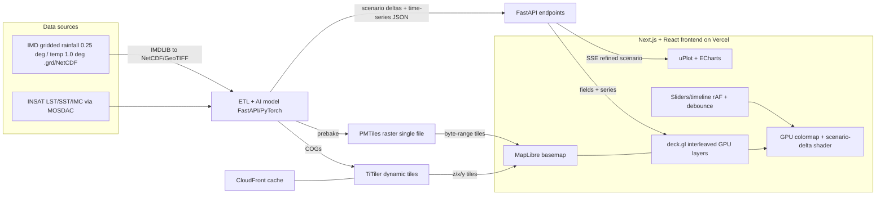

# 05 — Visualization, Dashboard & "What-If" Module

**Project:** ISRO BAH 2026 — PS5 "AI-Powered Digital Twin of India's Climate"
**Scope of this doc:** Web geospatial visualization + interactive dashboard + scenario ("what-if") simulation UI.
**Date:** 2026-06-21
**Author role:** Deep-research specialist (web geospatial viz & interactive dashboards)

> **TL;DR recommendation (full justification at the end):** Build a **Next.js (App Router) + React** frontend, with **MapLibre GL JS** as the basemap engine and **deck.gl** (interleaved via `MapboxOverlay`) as the GPU rendering layer for animated rainfall/temperature fields and H3 hex aggregation. Serve climate rasters as **Cloud-Optimized GeoTIFFs (COGs)** through **TiTiler** for the heavy lifting, and pre-bake the demo timesteps into **PMTiles** (raster) or a **Zarr pyramid** for instant, serverless playback. Apply **colormaps on the GPU** (deck.gl `BitmapLayer` + custom shader / `deck.gl-raster` pattern, or a CarbonPlan-style regl/Zarr layer). Charts: **uPlot** for fast point time-series + **ECharts** for richer climatology/scenario panels. What-if = **debounced sliders → client-side recompute of precomputed scenario deltas** for instant feedback, with an optional server round-trip via **SSE** for AI-model-driven scenarios. Add a **maplibre-gl-compare** before/after swipe for the "wow" moment. Deploy frontend on **Vercel**, tiler on a small container / AWS Lambda + CloudFront.

---

## 0. Requirements recap (what the UI must do)

From `idea.md` (PS5 deliverables), the visualization layer must provide:

1. **Interactive geospatial map dashboard** — rainfall + temperature over India (or a pilot region), **animated through time**, **click-a-point time series**, **layer toggles**.
2. **"What-if" scenario simulation module** — **sliders** to change temperature/rainfall and see impacts on the **map + charts in near real time**.
3. Feel **fast and modern** (this is an explicitly scored evaluation parameter: *"Visualization & User Interface"* and *"Innovation & Creativity"*).
4. Backend serves **COG/raster tiles + time series**; the client renders rasters/heatmaps over a basemap.

**Source data realities (drives the whole pipeline):**
- IMD **gridded rainfall** is **0.25° × 0.25°** (≈ 135 × 129 grid over India) in `.grd` binary or NetCDF.
- IMD **gridded temperature** (max/min) is **1.0° × 1.0°** in `.grd`/NetCDF.
- INSAT products (LST, SST, IMC rainfall) from MOSDAC.
- **`IMDLIB`** (Python) downloads and converts IMD binary `.grd` → **NetCDF / GeoTIFF / CSV** and loads as `xarray` DataArrays, so the path from raw IMD data → COG → tiles is well-trodden. See [IMDLIB paper](https://www.sciencedirect.com/science/article/abs/pii/S1364815223002554) and [IMDLIB intro](https://pratiman-91.github.io/2020/10/05/IMDLIB.html); alt. tool [imd_grd_to_nc](https://github.com/cemac/imd_grd_to_nc).

**Implication:** these grids are *small* (a single India timestep at 0.25° is ~17k cells ≈ tens of KB). That is the single most important fact for the architecture: **the entire animated field for a pilot region can live in the browser**, enabling buttery-smooth GPU animation and *instant* what-if recompute without server round-trips. We design around that.

---

## 1. Web map / rendering libraries

### 1.1 The candidates, at a glance

| Library | Engine | Best at | Weak at | License | Verdict for PS5 |
|---|---|---|---|---|---|
| **MapLibre GL JS** | WebGL2 (luma.gl refactor underway) | Fast basemap, vector tiles, **raster sources**, **PMTiles**, globe view (v5) | Custom analytical/GPU layers | **BSD-3 (open)** | ✅ **Basemap engine** |
| **deck.gl** | WebGL2 (WebGPU WIP) | **GPU layers** for millions of features, Heatmap/H3/Contour/Grid/Bitmap, GPU animation/transitions | Heavier; raw basemap nav | MIT | ✅ **Data/raster rendering layer** |
| **Mapbox GL JS v2+** | WebGL2 | Polished basemaps, ecosystem | **Proprietary, billable map loads** | Proprietary (v2+) | ❌ avoid (license/cost) |
| **Kepler.gl** | deck.gl under the hood | No-code exploratory geo-analytics, quick demos | Hard to embed as bespoke product UI | MIT | ⚠️ prototype-only |
| **CesiumJS / Resium** | WebGL | **True 3D globe**, WGS84 terrain, time-dynamic entities, "digital twin" branding | Heavier, steeper curve, overkill for 2D fields | Apache-2.0 | ⚠️ optional 3D "wow" view |
| **Leaflet (+georaster-layer)** | Canvas/DOM | Simple maps, quick COG-in-browser | **No GPU**, slow for animated big fields | BSD-2 | ⚠️ fallback only |
| **Three.js / r3f, Globe.gl** | WebGL | Custom 3D, stylized globe | Not geospatial-native (you rebuild projections/tiling) | MIT | ❌ too much yak-shaving |

### 1.2 Why MapLibre (basemap) + deck.gl (data) — the winning combo

The recurring expert recommendation is **not to choose one** — use **MapLibre for the basemap/navigation and deck.gl for GPU data layers**, integrated in **interleaved mode**:

- deck.gl is *"a framework for visualization, animation and 3D editing of large volumes of data (up to millions of points) … with optimal performance thanks to WebGL technology and GPU computing power"* — best when *"the main priority is dense data visualization and custom analytical layers."* ([geomatico](https://geomatico.es/en/vector-tiles-mapbox-maplibre-or-deckgl-for-my-3d-map/), [Atlas comparison](https://atlas.co/comparisons/deck-gl-vs-maplibre/))
- MapLibre is *"highly optimized for rendering"* basemaps/PMTiles and general map navigation; deck.gl has *"greater capacity for advanced visualization techniques like custom shaders and blend modes."* ([Atlas](https://atlas.co/comparisons/deck-gl-vs-maplibre/))
- **Interleaved integration:** `MapboxOverlay({ interleaved: true })` renders deck.gl layers **into MapLibre's own WebGL2 context**, sharing one context, so labels can sit above data and 3D occludes correctly. Requires `maplibre-gl@>=3`; works with MapLibre **v5 globe** for all integration modes. ([deck.gl: Using with MapLibre](https://deck.gl/docs/developer-guide/base-maps/using-with-maplibre), [MapboxOverlay](https://deck.gl/docs/api-reference/mapbox/mapbox-overlay), [maplibre-overlay gallery](https://deck.gl/gallery/maplibre-overlay))
- **License:** Mapbox GL JS went **proprietary at v2.0.0** (Dec 2020) — *"a billable map load occurs whenever a Map object is initialized."* MapLibre is the **BSD-3 open-source successor** and is provider-independent. For a government/ISRO ("Atmanirbhar Bharat", indigenous) hackathon, **MapLibre is the correct, defensible choice.** ([Geoapify](https://www.geoapify.com/mapbox-gl-new-license-and-6-free-alternatives/), [MapLibre](https://github.com/maplibre/maplibre-gl-js), [CARTO](https://carto.com/blog/our-thoughts-as-mapboxgl-js-2-goes-proprietary/))

### 1.3 deck.gl layers for climate fields (which layer for what)

deck.gl is *"designed as a GPU-powered, highly performant large-scale data visualization"* framework. Key layers for this project ([Aggregation Layers overview](https://deck.gl/docs/api-reference/aggregation-layers/overview)):

- **`BitmapLayer`** — drape a single raster image (one timestep) over the map. The image prop now accepts plain `{data: Uint8Array, width, height}` **and `HTMLVideoElement` that continuously updates** — useful for pre-rendered animation. ([BitmapLayer](https://deck.gl/docs/api-reference/layers/bitmap-layer), [What's New](https://deck.gl/docs/whats-new)) → **primary layer for animated rainfall/temperature fields rendered client-side from arrays.**
- **`deck.gl-raster` `RasterLayer`** (Kyle Barron) — a **subclass of `BitmapLayer`** that does **all image ops on the GPU**: band combination, spectral indices, and **colormap application** via shader injection points `DECKGL_CREATE_COLOR` / `DECKGL_MUTATE_COLOR`. Key benefit: changing colormap/index is *"much faster"* than re-fetching server-rendered images. **Limitation: 8-bit imagery only** (16-bit is a future goal), community-maintained. ([overview](https://kylebarron.dev/deck.gl-raster/overview/), [RasterLayer](https://kylebarron.dev/deck.gl-raster/layers/raster-layer/), [colormaps](https://kylebarron.dev/deck.gl-raster/colormaps/)) → **the pattern to copy for GPU colormaps**, even if we hand-roll a small shader instead of adopting the lib.
- **`HeatmapLayer`** — GPU **Gaussian KDE** heatmap of point/weighted data. Has `weightsTextureSize` and `debounceTimeout` perf props. ([HeatmapLayer](https://deck.gl/docs/api-reference/aggregation-layers/heatmap-layer)) → good for station/point density or smoothed rainfall intensity.
- **`H3HexagonLayer`** — H3 hex aggregation; supports `highPrecision: false` for **faster low-precision rendering**. ([H3HexagonLayer](https://deck.gl/docs/api-reference/aggregation-layers/h3-hexagon-layer)) → **the requested H3 hex aggregation view** (great for binning the grid into clean hex cells with extrudable height = value).
- **`ContourLayer`** — GPU iso-contours / iso-bands from aggregated data → isohyets (rainfall) / isotherms (temperature).
- **`GridLayer` / `ScreenGridLayer` / `HexagonLayer`** — CPU or **GPU** aggregation. Critically: *"when working with large datasets (>100K) GPU is much faster than CPU"* — enable `gpuAggregation`. ([Aggregation overview](https://deck.gl/docs/api-reference/aggregation-layers/overview)) Our grids are small, so even CPU is instant, but GPU aggregation future-proofs national scale-up.

### 1.4 The "wow": animated particle field (Windy/earth-nullschool style)

The iconic flowing-wind look used by **earth.nullschool.net, Windy, and Ventusky** is a **GPU particle system**: store the vector field as a texture, keep **particle positions in a texture**, and each frame look up the field at each particle, advect it, fade the previous frame, and respawn a fraction of particles randomly so the field never empties. *"WebGL is used to dramatically accelerate rendering using the GPU."* ([earth](https://earth.nullschool.net/), [Ventusky](https://www.ventusky.com/), [Fluid Earth writeup](https://www.geographyrealm.com/fluid-earth-open-source-visualization-weather-climate-data/), Agafonkin's canonical technique reimplemented in [webgl-wind](https://github.com/mapbox/webgl-wind) — *"up to 1 million wind particles at 60fps"*, data shipped as **PNG + JSON**).

- **Reusable:** `webgl-wind`'s technique generalizes — it ingests wind as PNG textures and is adaptable to any raster climate field; for **rainfall/temperature you primarily need the colored bitmap layer + a GPU colormap**, and can *optionally* add particle flow for monsoon wind/moisture transport as a showstopper.
- For PS5, the **must-have** is the smooth color field; the **particle flow is an optional differentiator** (maps directly to "monsoon variability" in the problem statement). If included, MapLibre even runs particle wind layers as plugins.

### 1.5 Optional 3D globe (CesiumJS/Resium) — keep it as a secondary tab

Cesium *"is the platform for 3D geospatial"* and explicitly markets **digital twins** + **time-dynamic weather/satellite** visualization with an accurate WGS84 globe and real terrain. deck.gl is *"more accessible … especially for React developers."* ([MATOM Cesium vs deck.gl](https://matom.ai/insights/cesium-vs-deck-gl/), [Cesium digital twins](https://cesium.com/use-cases/digital-twins/)). **Recommendation:** don't build the whole app in Cesium (overkill, slower to iterate). MapLibre **v5 has a globe projection** that, with deck.gl interleaved, gives 80% of the 3D "wow" for 20% of the effort. Reserve Cesium/Resium for a single optional "3D globe view" if time permits and you want to literally show a spinning digital twin of Earth.

---

## 2. Raster-in-browser & dynamic tiling

Three viable strategies, in order of recommendation for this project:

### Strategy A (recommended primary) — **Client-side array → GPU** (small grids)
Because IMD pilot-region grids are tiny, **fetch the raw values as a typed array** (NetCDF→JSON/binary, or COG read via `geotiff.js`) and render via deck.gl `BitmapLayer`/`RasterLayer` with a **GPU colormap**. This is exactly the **CarbonPlan `@carbonplan/maps` / `zarr-layer`** approach: read **Zarr** with `zarr-js`, render chunks with **regl/WebGL** as grids/textures, **colormaps + alpha + dynamic slicing across variables and time applied on the GPU**, multi-resolution via **`ndpyramid`**. *"Each tile is rendered using a regl-based WebGL raster component, which supports colormaps, alpha blending, and dynamic slicing across variables and time dimensions."* ([carbonplan/maps](https://github.com/carbonplan/maps), [maps blog](https://carbonplan.org/blog/maps-library-release), [zarr-layer](https://github.com/carbonplan/zarr-layer) + [demo](https://zarr-layer.demo.carbonplan.org/), [zarr-vis update](https://carbonplan.org/blog/zarr-visualization-update)).
- **Pros:** instant colormap/timestep/variable switching, no tile server in the hot path, perfect for **what-if recompute on GPU**, serverless-friendly.
- **Cons:** CarbonPlan stack pins **Web Mercator** + **mapbox-gl v1**; for an open stack, replicate the *pattern* with deck.gl/MapLibre rather than adopting the lib verbatim. `deck.gl-raster` is **8-bit only**.

### Strategy B (recommended for scale / national view) — **Dynamic tiling with TiTiler**
**TiTiler** = *"a lightweight FastAPI application … to create web map tiles dynamically from Cloud Optimized GeoTIFF (COG), STAC, or MosaicJSON"* (built on FastAPI + Rasterio/GDAL). Supports **`/cog` endpoints**, **`colormap_name`/`colormaps`** + **`rescale=min,max`** params (and **custom registered colormaps** via `rio_tiler.colormap` + `create_colormap_dependency`), multiple projections, WMTS, virtual mosaics, and a `titiler.xarray` package for multidim data. ([TiTiler](https://github.com/developmentseed/titiler), [/cog endpoints](https://developmentseed.org/titiler/endpoints/cog/), [custom colormap discussion](https://github.com/developmentseed/titiler/discussions/1264), [build a dynamic tile server](https://dev.to/mierune/building-a-dynamic-tile-server-using-cloud-optimized-geotiffcog-with-titiler-alg)).
- **Deployment:** Docker images on Docker Hub / AWS ECR; **AWS Lambda via `mangum`** wrapper + API Gateway (deployed with AWS CDK); put **CloudFront in front** to cache tiles and to *"circumvent issues that API Gateway has serving image content."* GDAL/VSI cache env vars tune COG performance. ([TiTiler AWS Lambda](https://developmentseed.org/titiler/deployment/aws/lambda/), [AWS intro](https://developmentseed.org/titiler/deployment/aws/intro/), [Docker Hub](https://hub.docker.com/r/developmentseed/titiler)). `rio-tiler` is the underlying lib, *"useful … in conjunction with a REST API such as a dynamic tiler like TiTiler."* ([rio-tiler](https://pypi.org/project/rio-tiler/)).
- Consume in MapLibre as a **raster source** (`{z}/{x}/{y}` from TiTiler) or in deck.gl via **`TileLayer`** (composite layer that *"only loads and rendering what's visible in the current viewport"* + request scheduler that prioritizes recently visible tiles). ([deck.gl TileLayer](https://deck.gl/docs/api-reference/geo-layers/tile-layer)).

### Strategy C (recommended for the *demo*) — **PMTiles, serverless, single file**
**PMTiles** = *"a single-file format for vector or raster map tiles … host one file on any static host; MapLibre requests byte ranges over HTTP."* One archive holds the **full XYZ pyramid + all layers**; supports **raster (PNG/JPEG)** and **raster-DEM**; enables *"low-cost, zero-maintenance … serverless"* maps. MapLibre needs the **PMTiles protocol handler**; deck.gl can also consume PMTiles. ([protomaps/PMTiles](https://github.com/protomaps/PMTiles), [PMTiles for MapLibre](https://docs.protomaps.com/pmtiles/maplibre), [cloud-native guide](https://guide.cloudnativegeo.org/pmtiles/intro.html), [PMTiles in deck.gl](https://medium.com/center-for-coastal-climate-resilience-visualizatio/pmtiles-in-deck-gl-part-i-1ec68814f2da)).
- **Use it to:** pre-bake the demo's animated timesteps + the India basemap into PMTiles so the live demo **never depends on a running server** (huge de-risking for a hackathon stage demo on flaky Wi-Fi).

### Browser raster libraries summary
- **`geotiff.js`** — *"small library to parse TIFF files … pure JavaScript … browser and node.js,"* reads COG via HTTP range requests → feed arrays to deck.gl. ([geotiff.js](https://github.com/geotiffjs/geotiff.js/)). Decode in a **Web Worker**.
- **`georaster-layer-for-leaflet`** — renders COGs on a **Leaflet canvas** but is **CPU/Canvas (no GPU)** and intended for **small** GeoTIFFs; depends on `proj4`. Fine for a quick Leaflet fallback, **not** for smooth animation. ([npm](https://www.npmjs.com/package/georaster-layer-for-leaflet), [GitHub](https://github.com/GeoTIFF/georaster-layer-for-leaflet)).
- **Zarr in browser** — `zarr-js`/`zarr.js`, plus `titiler-multidim`, `carbonplan/maps`, `zarr-gl`; Zarr *"separates metadata into lightweight JSON … chunked, compressed binary … independent, thread-safe retrieval of chunks."* Rasterio is faster on small data; **Zarr wins at large/multidim scale**. ([Zarr-vis report](https://nasa-impact.github.io/zarr-visualization-report/approaches/dynamic-client.html), [Zarr in the browser](https://medium.com/@tobias.ramalho.ferreira/zarr-in-the-browser-fast-flexible-and-surprisingly-powerful-for-big-geo-data-eeb90ddf8a3d), [perf paper](https://arxiv.org/html/2411.11291)).

**GPU colormap, in one sentence:** upload the data as a single-channel texture + a small 256×1 **colormap lookup texture**; the fragment shader maps `value → normalized → texture2D(colormap, value)`. This is what `deck.gl-raster` and CarbonPlan both do, and it makes **colormap and rescale changes instantaneous**.

---

## 3. Dashboard framework

| Framework | Language | Time-to-build | "Wow"/polish | Map story | Best for | Verdict |
|---|---|---|---|---|---|---|
| **Next.js + React** | TS/JS | Medium | **Highest** | First-class (react-map-gl + deck.gl) | Production "wow" demo | ✅ **Recommended** |
| **Streamlit** | Python | **Fastest** | Medium | `st.map`/PyDeck (kepler/deck under hood) | Python-native rapid PoC | ⚠️ great fallback |
| **Dash / Plotly** | Python | Fast | Medium-High | dash-leaflet / dash-deck | Structured analytical apps | ⚠️ alt. Python route |
| **Panel / HoloViz** | Python | Fast | Medium-High | **Datashader** for billions of rows | Heavy server-side data | ⚠️ if huge data |
| **Observable Framework** | JS + any | Medium | High | D3/deck/Observable Plot | Static, instant-load dashboards | ⚠️ if mostly precomputed |

**Evidence:**
- *"Streamlit is best for fast internal data applications and prototypes, Dash provides more structure … and React is the best choice when building full production data products. Many successful data applications evolve from Streamlit → Dash → React."* ([Lean Data Engineer](https://leandataengineer.com/blog/dash-vs-streamlit-vs-react-for-data-applications/), [Squadbase 2025](https://www.squadbase.dev/en/blog/streamlit-vs-dash-in-2025-comparing-data-app-frameworks)).
- **Streamlit** maps via `st.map` (uses **kepler.gl/PyDeck** under the hood), with **PyDeck recommended** for geospatial; but it *"holds a Python thread and UI objects per connection, so RAM grows linearly with users"* and reruns the whole script on each interaction — **this fights the responsive what-if slider UX**. ([streamlit.io](https://streamlit.io/), search summary above).
- **Panel** has *"first class support for Datashader for visualizing millions and billions of rows"* — relevant only if you render the whole-India high-res field server-side. ([holoviz/panel](https://github.com/holoviz/panel)).
- **Observable Framework** *"data loaders … precompute static snapshots of data at build time for dashboards that load instantly … handling everything client-side … faster load times."* Built by the creator of D3. ([observablehq/framework](https://github.com/observablehq/framework), [Appsilon](https://www.appsilon.com/post/observable-framework-data-science-dashboards)).
- **Next.js** gotcha: **maps must be client-only** — *"deck.gl imports should be isolated and excluded from SSR … use `dynamic(..., {ssr:false})`"* and `'use client'`, because map libs need browser APIs (WebGL/`window`). ([deck.gl + React](https://deck.gl/docs/get-started/using-with-react), [react-map-gl get-started](https://visgl.github.io/react-map-gl/docs/get-started), [Next.js map approach](https://medium.com/@silvajohnny777/how-to-properly-render-maps-in-next-js-my-go-to-approach-f6188acd51aa), [Next 13 + deck.gl HexagonLayer](https://medium.com/@pether.maciejewski/next-js-13-mapbox-deck-gl-hexagon-layer-step-by-step-5528e7366750)).

**Decision for PS5:** Go **Next.js + React**. The deliverable is *judged on UI/innovation*, the what-if module needs **sub-100ms slider feedback** (best done client-side in JS, awkward in Streamlit's rerun model), and the map ecosystem (react-map-gl/MapLibre + deck.gl) is React-native. **Keep Streamlit as a backup plan** if frontend time runs out — it can wrap the same TiTiler/PyDeck layers for a credible (if less flashy) demo in a day. **Decouple cleanly:** FastAPI backend (model + TiTiler + time-series JSON) so the *same* backend serves either a Next.js or Streamlit front (mirrors the well-documented "FastAPI + Streamlit + Next.js" pattern, [Jaehyeon Kim series](https://jaehyeon.me/series/realtime-dashboard-with-fastapi-streamlit-and-next.js/)).

---

## 4. Charting / time series

| Library | Engine | Speed (large/streaming) | DX | Use it for |
|---|---|---|---|---|
| **uPlot** | Canvas 2D | **Fastest** (166k pts in ~25ms; 3.6k pts @60fps = 10% CPU/12MB) | Spartan, poor docs | **Click-a-point time series**, long climatology lines, live what-if |
| **ECharts** | Canvas/SVG | Excellent for large data & realtime | Rich, large API | Climatology panels, scenario comparison, heatmap calendars, animated transitions |
| **Plotly** | SVG/WebGL | Heavier, slower at scale | Easy, export-friendly | Quick exploratory / Python parity (Dash/Streamlit) |
| **Recharts** | SVG | **Slow for streaming** (SVG re-renders) | Very React-friendly | Small static dashboard widgets only |
| **D3** | SVG/Canvas | Full control | Most effort | Bespoke isohyet legends, custom brushing |
| **Vega-Lite** | Canvas/SVG | Good | Declarative grammar | **Linked brushing / crossfilter** dashboards |

**Evidence:**
- **uPlot:** *"a fast, memory-efficient Canvas 2D-based chart … 166,650 data points in 25ms from a cold start … ~50 KB … likely the smallest and fastest time series plotter."* Updating 3,600 pts @60fps uses **10% CPU / 12.3MB** vs ECharts **70% / 85MB**. Downside: *"docs are not good at all."* ([uPlot](https://github.com/leeoniya/uPlot), [Casey Primozic notes](https://cprimozic.net/notes/posts/my-thoughts-on-the-uplot-charting-library/)).
- **ECharts:** *"for high-performance real-time apps, ECharts leads the pack … technically superior"* for large datasets; richer than uPlot. ([library comparison](https://medium.com/@ponshriharini/comparing-8-popular-react-charting-libraries-performance-features-and-use-cases-cc178d80b3ba)).
- **Plotly:** *"heavier than Recharts and slower than ECharts for massive datasets … use when stakeholders value sharing over performance."* **Recharts:** *"avoid for streaming data since SVG re-renders are slow."*
- **Vega-Lite linked brushing:** *"an interval selection (brush) … in one plot … used to filter the points in another"*; **setting scale domains (not filtering) yields superior interactive performance.** Built on Vega/D3, inspired by Crossfilter.js. ([Vega-Lite examples](https://vega.github.io/vega-lite/examples/), [brushing-and-linking](https://observablehq.com/@weiglemc/brushing-and-linking-example-with-vega-lite), [crossfilter](https://vega.github.io/vega-lite/examples/interactive_crossfilter.html)).

**Decision:** **uPlot** for the high-frequency, always-visible click-a-point time-series (it must redraw instantly as the user scrubs the time slider and drags what-if sliders), **ECharts** for the richer scenario-comparison + climatology + calendar-heatmap panels (better OOTB styling and animated transitions for the "wow"). Skip Recharts for anything live.

---

## 5. "What-if" UI patterns (the differentiator)

**Core interaction model (recommended): precomputed scenario deltas + client-side GPU recompute.**
Because the pilot grids are tiny and the AI model is expensive, **precompute a small set of scenario response surfaces / deltas** (e.g., Δrainfall and Δtemperature fields for a grid of slider settings, or sensitivity coefficients), ship them to the browser, and let the slider **interpolate/apply the delta on the GPU in the fragment shader**. Result: the map + charts update on **every slider tick at 60fps with zero server latency** — exactly the *"impacts on the map + charts in near real time"* the PS demands.

**Supporting patterns and the evidence behind them:**

1. **Debounce vs throttle vs `requestAnimationFrame`:**
   - *"Debounce groups a sudden burst of events into a single one; throttle guarantees a constant flow … `requestAnimationFrame` is a throttle alternative."* Use **rAF for anything that affects how content looks on screen** (the map/chart redraw), and **debounce for the expensive tail action** (a server recompute / AI call fired only when the user *stops* dragging). ([CSS-Tricks](https://css-tricks.com/debouncing-throttling-explained-examples/), [Syncfusion](https://www.syncfusion.com/blogs/post/javascript-debounce-vs-throttle), [rAF in React](https://dev.to/tawe/requestanimationframe-explained-why-your-ui-feels-laggy-and-how-to-fix-it-3ep2)).
   - In React, *"`requestAnimationFrame` doesn't cancel/debounce React renders … pair it with `useRef` or non-state variables"* — i.e., drive the slider's live preview through refs + imperative deck.gl updates, and only commit to React state on debounce.
   - deck.gl gives **`debounceTimeout`** on `HeatmapLayer` and uses **`updateTriggers`** so only the changed accessor's GPU buffers recompute (avoid full data recalculation per frame). Generic **prop transitions** (numbers/arrays) animate on the GPU. ([deck.gl performance](https://deck.gl/docs/developer-guide/performance), [animations & transitions](https://deck.gl/docs/developer-guide/animations-and-transitions)).

2. **Before/after swipe comparison** — `maplibre-gl-compare`: *"swipe and sync between two maps … draggable slider … perfect for before/after."* Options: `mousemove`, `orientation`. (`maplibre-gl-swipe` is a single-map layer-swipe alternative.) Use it to compare **baseline vs scenario** or **observed vs AI-predicted**. ([maplibre-gl-compare](https://github.com/maplibre/maplibre-gl-compare), [maplibre-gl-swipe](https://github.com/opengeos/maplibre-gl-swipe)).

3. **Optimistic UI** — render the **client-side delta immediately** (optimistic), and if a server/AI recompute is in flight, reconcile when it returns; show a subtle "refining…" shimmer. Avoids any perceived lag.

4. **Linked map + chart brushing** — brushing a region on the map filters/highlights the time-series and climatology charts and vice-versa; Vega-Lite or a small custom selection store both work (set scale domains for speed).

5. **Animated transitions** — when the scenario commits, **tween the colormap / values** (deck.gl prop transitions) instead of snapping, for a polished feel.

6. **Server streaming when the AI model is actually run** — for a *real* model-driven scenario (not just a delta), stream progress/results. **SSE vs WebSocket:** *"If you just need to push a stream of constant updates … SSE … more suitable"*; WebSockets win when you need **bidirectional** + **mid-stream cancellation** (*"with SSE, the client drops the connection but the server keeps generating until it notices the disconnect"*). FastAPI supports both (Starlette has SSE built-in). **Recommendation:** **SSE** for one-way progress/result streaming (simplest), upgrade to **WebSocket** only if you need to cancel long model runs mid-flight. ([Ably SSE vs WS](https://ably.com/blog/websockets-vs-sse), [FastAPI SSE](https://mahdijafaridev.medium.com/implementing-server-sent-events-sse-with-fastapi-real-time-updates-made-simple-6492f8bfc154), [FastAPI+React SSE repo](https://github.com/harshitsinghai77/server-sent-events-using-fastapi-and-reactjs)).

**What-if module recommended architecture:**
```
slider drag ──(rAF, refs)──► apply Δ on GPU shader ──► map + uPlot redraw  (0 ms server)
        └──(debounced ~300ms, on release)──► POST /scenario ──SSE──► AI-refined field ──► reconcile (optimistic)
```

---

## 6. Performance toolkit

- **Keep the field in the browser** (small grids) → animate by swapping a **texture per timestep**; no per-frame network. For national high-res, switch to **tiles** (TiTiler/PMTiles) + deck.gl `TileLayer` LOD.
- **GPU everything that's per-pixel/per-frame:** colormaps, rescale, scenario deltas, aggregation (`gpuAggregation: true` — *">100K GPU much faster than CPU"*), transitions (GPU attribute transitions). ([Aggregation overview](https://deck.gl/docs/api-reference/aggregation-layers/overview), [animations & transitions](https://deck.gl/docs/developer-guide/animations-and-transitions)).
- **deck.gl `updateTriggers`** to avoid full buffer rebuilds; **binary attributes** for big data; pre-build typed arrays. ([performance guide](https://deck.gl/docs/developer-guide/performance)).
- **Web Workers** for COG/NetCDF/Zarr **decode** (geotiff.js / zarr-js) and any heavy parsing, off the main thread.
- **WASM** where geometry ops are heavy (GEOS-WASM); pass geometries as **WKB not text** for speed. ([GEOS-WASM perf](https://www.docswell.com/s/sanak/Z1JEL3-2023-11-30-100118)). For PS5 this is likely **not needed** (grids are rasters), list as scale-up option.
- **Tile caching:** CloudFront/CDN in front of TiTiler; immutable tile URLs (include variable+time+colormap+rescale in the path) so the CDN/browser cache hit-rate is high. ([TiTiler AWS](https://developmentseed.org/titiler/deployment/aws/lambda/)).
- **PMTiles** = serverless byte-range tiles, no tile server to scale or fail mid-demo. ([PMTiles](https://github.com/protomaps/PMTiles)).
- **Animation loop:** a single `requestAnimationFrame` clock drives the time index; **throttle the per-frame data swap** to the data cadence (e.g., daily) while interpolating colors between frames for smoothness.
- **Charts:** **uPlot** (Canvas) over SVG libs for live redraw; for Vega-Lite, **set scale domains** rather than filtering for fast brushing.
- **WebGPU (forward-looking, not yet):** deck.gl **v9 does NOT yet support WebGPU**; v9.1+ ports luma.gl to WebGPU incrementally — *"not production ready"* as of the v9.x line. MapLibre is also doing a **luma.gl refactor** toward this. **Plan on WebGL2 now**, WebGPU as a free future upgrade. ([deck.gl WebGPU](https://deck.gl/docs/developer-guide/webgpu), [What's New](https://deck.gl/docs/whats-new), [MapLibre luma refactor](https://maplibre.org/roadmap/maplibre-gl-js/luma-gl-refactor/)).

---

## 7. UX patterns to steal from the best climate dashboards

**NASA Worldview** ([worldview.earthdata.nasa.gov](https://worldview.earthdata.nasa.gov/), [Earthdata](https://www.earthdata.nasa.gov/data/tools/worldview)) — *"interactively browse, compare, animate, and download over 1,200 … products."*
- **Timeline at the bottom** with **Days/Months/Years range buttons** + **drag-to-sweep** scrubber + **play/loop animation**. ← copy this exact timeline pattern.
- **Layer List**: show/hide, add/remove, reorder, per-layer opacity, descriptions, and a **Comparison mode** toggle (swipe/spy/opacity). ← our layer toggles + opacity + compare.
- **Mobile-friendly, embeddable, storytelling/permalinks** (shareable state in URL). ← add URL-encoded app state for shareable scenarios.

**Windy / Ventusky / earth.nullschool** ([windy.com](https://www.windy.com/), [ventusky.com](https://www.ventusky.com/), [earth](https://earth.nullschool.net/)) —
- **Animated GPU particle overlay** on a smooth color field = instant "wow"; **click anywhere → popup time-series/meteogram**; **variable switcher** (temp/rain/wind…) with **legend that doubles as a colormap key**; minimal chrome, map-first. ← our click-a-point + variable switcher + flow overlay.

**Climate Engine** ([climateengine.org](https://climateengine.org/)) & **Google Earth Engine Apps** ([earthengine.app](https://www.earthengine.app/)) —
- Backed by GEE cloud compute; **on-the-fly analysis + scenario/threshold controls** in a side panel; clean **side-panel-controls / big-map** layout. ← our control rail layout, and the model that "what-if = recompute on the fly."

**Distilled UX checklist for PS5:**
1. **Map-first, full-bleed**; controls in a slim left rail + bottom timeline.
2. **Bottom timeline** with range presets, drag scrub, play/pause/loop, speed.
3. **Layer panel**: rainfall / temp(max/min) toggles, opacity sliders, colormap + legend, optional H3-hex / contour / particle toggles.
4. **Click-a-point** → docked panel with **uPlot time-series + climatology** for that cell; pin multiple points to compare.
5. **What-if panel**: ΔTemperature & ΔRainfall sliders (+ presets like "+2°C", "−20% monsoon"), **live map/chart update**, **before/after swipe**, "reset baseline".
6. **Shareable URL state** + **export PNG/GIF** of the animation (judge-friendly).
7. **Loading/skeletons + optimistic updates** so it always feels instant.

---

## 8. RECOMMENDED VISUALIZATION STACK

### 8.1 Opinionated stack (one line per concern)

| Concern | Choice | Why (1-liner) |
|---|---|---|
| **App framework** | **Next.js (App Router) + React + TypeScript** | Highest polish/wow, React-native map ecosystem, fast iteration, easy Vercel deploy. |
| **Basemap engine** | **MapLibre GL JS** (BSD-3) | Open, indigenous-friendly, fast nav, PMTiles + raster sources, v5 globe. |
| **Data/raster rendering** | **deck.gl** via `MapboxOverlay({interleaved:true})` | GPU `BitmapLayer`/`H3HexagonLayer`/`HeatmapLayer`/`ContourLayer`, shared WebGL2 context. |
| **GPU colormap** | Custom fragment shader (deck.gl-raster pattern) + 256×1 LUT texture | Instant colormap/rescale/scenario-delta on GPU. |
| **Heavy tiling backend** | **TiTiler** (FastAPI + rio-tiler) on container / Lambda + **CloudFront** | Dynamic COG tiles, colormaps, mosaics for national scale-up. |
| **Demo data delivery** | **PMTiles** (raster) + small typed-array/Zarr fields | Serverless, byte-range, demo never depends on a live server. |
| **Raster decode** | `geotiff.js` (+ `zarr-js` if Zarr) in a **Web Worker** | Off-main-thread COG/Zarr reads. |
| **Time-series charts** | **uPlot** (live) + **ECharts** (rich panels) | Fastest live redraw + polished comparison/climatology. |
| **What-if model** | Precomputed deltas → **GPU client-side recompute**; rAF live + debounced commit; **SSE** for AI runs | Sub-frame slider feedback, optional model-driven refinement. |
| **Compare UX** | `maplibre-gl-compare` swipe | Baseline-vs-scenario / observed-vs-predicted "wow". |
| **State/data** | Zustand (UI state) + TanStack Query (server data) | Lightweight, fast, plays well with imperative map updates. |
| **Backend API** | **FastAPI** (model inference + time-series JSON + TiTiler) | Same backend can also feed a Streamlit fallback. |
| **Deploy** | **Vercel** (frontend) + container/Lambda+CloudFront (tiler) | Fast, modern, demo-friendly; CDN-cached tiles. |
| **Fallback plan** | **Streamlit + PyDeck** on the same FastAPI backend | 1-day Python-native demo if frontend time runs out. |

**Headline justification:** IMD pilot grids are tiny → keep fields in the browser → animate via per-timestep GPU textures and apply scenario deltas in a shader → the map *and* charts update at 60fps with **zero server latency**, which is precisely the "near real time what-if" the problem statement scores. MapLibre+deck.gl is the open, React-native, GPU-accelerated combo every comparison points to, with TiTiler/PMTiles giving a credible **scale-up-to-national** story for the "scalable framework" outcome — without sacrificing demo reliability.

### 8.2 Component tree (frontend)

```
<App> (Next.js, "use client" boundary around the map)
├── <TopBar/>            region picker · variable (rain/Tmax/Tmin) · share · export
├── <LeftRail/>
│   ├── <LayerPanel/>    toggles (rainfall, temp, H3-hex, contour, particle flow) + opacity + colormap legend
│   └── <WhatIfPanel/>   ΔTemperature slider · ΔRainfall slider · presets · before/after swipe · reset
├── <MapStage/>  (dynamic import, ssr:false)
│   └── <MapLibreMap/>   basemap (PMTiles) + raster source
│        └── <DeckOverlay interleaved>
│             ├── BitmapLayer/RasterLayer  (animated field + GPU colormap + scenario Δ)
│             ├── H3HexagonLayer           (hex aggregation toggle)
│             ├── ContourLayer             (isohyet/isotherm toggle)
│             └── ParticleFlowLayer        (optional Windy-style overlay)
│        └── <ClickPopover/>               on-click cell selection → feeds charts
├── <BottomTimeline/>    range presets (D/M/Y) · scrub · play/pause/loop · speed  (rAF clock)
└── <ChartDock/>
    ├── <PointTimeSeries/> (uPlot)     selected cell, baseline vs scenario overlay
    └── <ClimatologyPanel/> (ECharts)  monthly climatology · scenario comparison · calendar heatmap
```

### 8.3 System / data-flow sketch (Mermaid)



---

## 9. Risks, watch-outs & mitigations

- **deck.gl in Next.js SSR** → always `dynamic(..., {ssr:false})` + `'use client'`; never import map code on the server. ([deck.gl React](https://deck.gl/docs/get-started/using-with-react)).
- **deck.gl-raster is 8-bit only** → for continuous temp/rainfall, hand-roll the colormap shader (normalize float → LUT) rather than relying on the 8-bit lib, *or* pre-quantize to 8-bit for the demo. ([deck.gl-raster overview](https://kylebarron.dev/deck.gl-raster/overview/)).
- **CarbonPlan maps lib pins Mercator + mapbox-gl v1** → copy the *pattern* (Zarr+regl+GPU colormap), implement on MapLibre/deck.gl to stay open-source. ([carbonplan/maps](https://github.com/carbonplan/maps)).
- **WebGPU not ready** in deck.gl v9.x → target WebGL2; treat WebGPU as a later upgrade. ([deck.gl WebGPU](https://deck.gl/docs/developer-guide/webgpu)).
- **Streamlit reruns** make slider what-if feel laggy → prefer React; if Streamlit fallback, cache aggressively and precompute deltas. ([Squadbase](https://www.squadbase.dev/en/blog/streamlit-vs-dash-in-2025-comparing-data-app-frameworks)).
- **API Gateway + image bytes** quirk → front TiTiler with CloudFront. ([TiTiler AWS](https://developmentseed.org/titiler/deployment/aws/lambda/)).
- **Demo reliability** → pre-bake PMTiles so the live demo runs without the tiler/model online. ([PMTiles](https://github.com/protomaps/PMTiles)).

---

## 10. Sources

**Map / rendering libraries**
- deck.gl — Using with MapLibre: https://deck.gl/docs/developer-guide/base-maps/using-with-maplibre
- deck.gl — MapboxOverlay (interleaved): https://deck.gl/docs/api-reference/mapbox/mapbox-overlay
- deck.gl — MapLibre overlay gallery: https://deck.gl/gallery/maplibre-overlay
- deck.gl vs MapLibre (Atlas): https://atlas.co/comparisons/deck-gl-vs-maplibre/
- Vector tiles: Mapbox/MapLibre/DeckGL (geomatico): https://geomatico.es/en/vector-tiles-mapbox-maplibre-or-deckgl-for-my-3d-map/
- deck.gl Aggregation Layers overview: https://deck.gl/docs/api-reference/aggregation-layers/overview
- deck.gl HeatmapLayer: https://deck.gl/docs/api-reference/aggregation-layers/heatmap-layer
- deck.gl H3HexagonLayer: https://deck.gl/docs/api-reference/aggregation-layers/h3-hexagon-layer
- deck.gl BitmapLayer: https://deck.gl/docs/api-reference/layers/bitmap-layer
- deck.gl TileLayer: https://deck.gl/docs/api-reference/geo-layers/tile-layer
- deck.gl What's New: https://deck.gl/docs/whats-new
- deck.gl WebGPU: https://deck.gl/docs/developer-guide/webgpu
- MapLibre GL JS (repo): https://github.com/maplibre/maplibre-gl-js
- MapLibre luma.gl refactor roadmap: https://maplibre.org/roadmap/maplibre-gl-js/luma-gl-refactor/
- Mapbox GL license change + alternatives (Geoapify): https://www.geoapify.com/mapbox-gl-new-license-and-6-free-alternatives/
- CARTO on Mapbox GL v2 proprietary: https://carto.com/blog/our-thoughts-as-mapboxgl-js-2-goes-proprietary/
- Cesium vs deck.gl (MATOM): https://matom.ai/insights/cesium-vs-deck-gl/
- Cesium digital twins: https://cesium.com/use-cases/digital-twins/

**Raster in browser / tiling**
- deck.gl-raster overview: https://kylebarron.dev/deck.gl-raster/overview/
- deck.gl-raster RasterLayer: https://kylebarron.dev/deck.gl-raster/layers/raster-layer/
- deck.gl-raster colormaps: https://kylebarron.dev/deck.gl-raster/colormaps/
- CarbonPlan maps (repo): https://github.com/carbonplan/maps
- CarbonPlan maps library release (blog): https://carbonplan.org/blog/maps-library-release
- CarbonPlan zarr-layer: https://github.com/carbonplan/zarr-layer
- CarbonPlan zarr-layer demo: https://zarr-layer.demo.carbonplan.org/
- CarbonPlan zarr visualization update: https://carbonplan.org/blog/zarr-visualization-update
- TiTiler (repo): https://github.com/developmentseed/titiler
- TiTiler /cog endpoints: https://developmentseed.org/titiler/endpoints/cog/
- TiTiler custom colormap discussion: https://github.com/developmentseed/titiler/discussions/1264
- TiTiler AWS Lambda deploy: https://developmentseed.org/titiler/deployment/aws/lambda/
- Build a dynamic COG tile server with TiTiler (DEV): https://dev.to/mierune/building-a-dynamic-tile-server-using-cloud-optimized-geotiffcog-with-titiler-alg
- rio-tiler (PyPI): https://pypi.org/project/rio-tiler/
- PMTiles (repo): https://github.com/protomaps/PMTiles
- PMTiles for MapLibre (Protomaps docs): https://docs.protomaps.com/pmtiles/maplibre
- PMTiles cloud-native guide: https://guide.cloudnativegeo.org/pmtiles/intro.html
- PMTiles in deck.gl (Medium): https://medium.com/center-for-coastal-climate-resilience-visualizatio/pmtiles-in-deck-gl-part-i-1ec68814f2da
- geotiff.js (repo): https://github.com/geotiffjs/geotiff.js/
- georaster-layer-for-leaflet (npm): https://www.npmjs.com/package/georaster-layer-for-leaflet
- Zarr visualization report (dynamic client): https://nasa-impact.github.io/zarr-visualization-report/approaches/dynamic-client.html
- Zarr in the browser (Medium): https://medium.com/@tobias.ramalho.ferreira/zarr-in-the-browser-fast-flexible-and-surprisingly-powerful-for-big-geo-data-eeb90ddf8a3d

**Dashboard frameworks**
- Dash vs Streamlit vs React (Lean Data Engineer): https://leandataengineer.com/blog/dash-vs-streamlit-vs-react-for-data-applications/
- Streamlit vs Dash 2025 (Squadbase): https://www.squadbase.dev/en/blog/streamlit-vs-dash-in-2025-comparing-data-app-frameworks
- Streamlit: https://streamlit.io/
- Panel / HoloViz (repo): https://github.com/holoviz/panel
- Observable Framework (repo): https://github.com/observablehq/framework
- Observable Framework dashboards (Appsilon): https://www.appsilon.com/post/observable-framework-data-science-dashboards
- FastAPI + Streamlit + Next.js series (Jaehyeon Kim): https://jaehyeon.me/series/realtime-dashboard-with-fastapi-streamlit-and-next.js/
- deck.gl with React: https://deck.gl/docs/get-started/using-with-react
- react-map-gl get started: https://visgl.github.io/react-map-gl/docs/get-started
- Next.js maps approach (Medium): https://medium.com/@silvajohnny777/how-to-properly-render-maps-in-next-js-my-go-to-approach-f6188acd51aa
- Next 13 + deck.gl HexagonLayer (Medium): https://medium.com/@pether.maciejewski/next-js-13-mapbox-deck-gl-hexagon-layer-step-by-step-5528e7366750

**Charting**
- uPlot (repo): https://github.com/leeoniya/uPlot
- uPlot thoughts (Casey Primozic): https://cprimozic.net/notes/posts/my-thoughts-on-the-uplot-charting-library/
- React charting libraries comparison (Medium): https://medium.com/@ponshriharini/comparing-8-popular-react-charting-libraries-performance-features-and-use-cases-cc178d80b3ba
- Vega-Lite examples: https://vega.github.io/vega-lite/examples/
- Vega-Lite brushing & linking (Observable): https://observablehq.com/@weiglemc/brushing-and-linking-example-with-vega-lite
- Vega-Lite crossfilter: https://vega.github.io/vega-lite/examples/interactive_crossfilter.html

**What-if / interaction / streaming / performance**
- deck.gl performance optimization: https://deck.gl/docs/developer-guide/performance
- deck.gl animations & transitions: https://deck.gl/docs/developer-guide/animations-and-transitions
- Debouncing & throttling (CSS-Tricks): https://css-tricks.com/debouncing-throttling-explained-examples/
- Debounce vs throttle (Syncfusion): https://www.syncfusion.com/blogs/post/javascript-debounce-vs-throttle
- requestAnimationFrame in React (DEV): https://dev.to/tawe/requestanimationframe-explained-why-your-ui-feels-laggy-and-how-to-fix-it-3ep2
- maplibre-gl-compare (repo): https://github.com/maplibre/maplibre-gl-compare
- maplibre-gl-swipe (repo): https://github.com/opengeos/maplibre-gl-swipe
- SSE vs WebSockets (Ably): https://ably.com/blog/websockets-vs-sse
- FastAPI SSE (Medium): https://mahdijafaridev.medium.com/implementing-server-sent-events-sse-with-fastapi-real-time-updates-made-simple-6492f8bfc154
- FastAPI + React SSE (repo): https://github.com/harshitsinghai77/server-sent-events-using-fastapi-and-reactjs
- GEOS-WASM in browser (FOSS4G Asia 2023): https://www.docswell.com/s/sanak/Z1JEL3-2023-11-30-100118

**Weather/climate dashboard UX references**
- earth.nullschool.net: https://earth.nullschool.net/
- Windy: https://www.windy.com/
- Ventusky: https://www.ventusky.com/
- webgl-wind (Mapbox): https://github.com/mapbox/webgl-wind
- Fluid Earth writeup: https://www.geographyrealm.com/fluid-earth-open-source-visualization-weather-climate-data/
- NASA Worldview: https://worldview.earthdata.nasa.gov/
- NASA Earthdata Worldview: https://www.earthdata.nasa.gov/data/tools/worldview
- Climate Engine: https://climateengine.org/
- Google Earth Engine Apps: https://www.earthengine.app/

**Project data (IMD)**
- IMDLIB paper (ScienceDirect): https://www.sciencedirect.com/science/article/abs/pii/S1364815223002554
- IMDLIB intro (Pratiman): https://pratiman-91.github.io/2020/10/05/IMDLIB.html
- imd_grd_to_nc (repo): https://github.com/cemac/imd_grd_to_nc
- Zarr vs Tiff performance (arXiv 2024): https://arxiv.org/html/2411.11291
